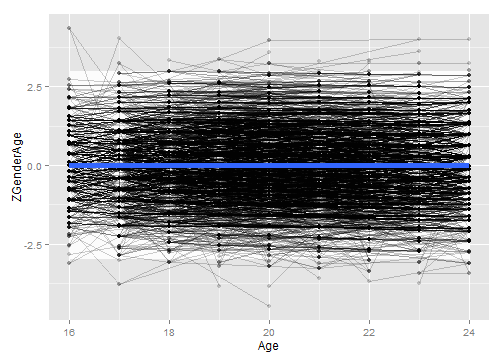

# Calculating Gen2 Height
This sequence picks a single height value per Gen2 subject.


## Define the age cutoffs to keep ages within the same Window as Gen1 Heights.  Define the height cutoffs to exclude values that are more likely to be entry errors or a developmental disorder, than a true reflection of additive genetics

```r
pathOutputSubjectHeight <- "./ForDistribution/Outcomes/Gen1Height/Gen1Height.csv"

inchesTotalMin <- 56 #4'8"
inchesTotalMax <- 80 #7'0"
feetOnlyMin <- 4
feetOnlyMax <- 8
inchesOnlyMin <- 0
inchesOnlyMax <- 11
ageMin <- 16
ageMax <- 24
zMin <- -3
zMax <- -zMin 


####################################################################################
```


## Load the appropriate information from the SQL Server database

```r
#Equivalent ages for 1981 Heights are 16-24 (ignoring two 15-year-old and 1 26-year-old)
# SELECT count([AgeSelfReportYears]), FLOOR([AgeCalculateYears]) AS Age
# FROM [NlsLinks].[Process].[tblSurveyTime]
# WHERE SurveyYear=1981
# GROUP BY floor([AgeCalculateYears]) ORDER BY Age

channel <- RODBC::odbcDriverConnect("driver={SQL Server}; Server=Bee\\Bass; Database=NlsLinks; Uid=NlsyReadWrite; Pwd=nophi")
dsLong <- sqlQuery(channel, 
                   "SELECT * 
                    FROM [NlsLinks].[Process].[vewOutcome]
                    WHERE Generation=1 AND ItemLabel in ('Gen1HeightInches') 
                    ORDER BY SubjectTag, SurveyYear" 
                   , stringsAsFactors=FALSE
)
dsSubject <- sqlQuery(channel, 
                    "SELECT SubjectTag 
                    FROM [NlsLinks].[Process].[tblSubject]
                    WHERE Generation=1 
                    ORDER BY SubjectTag" 
                    , stringsAsFactors=FALSE
)
odbcClose(channel)
summary(dsLong)
```

```
   SubjectTag        SurveyYear        Item      ItemLabel        
 Min.   :    200   Min.   :1982   Min.   :200   Length:12092      
 1st Qu.: 316075   1st Qu.:1982   1st Qu.:200   Class :character  
 Median : 629350   Median :1982   Median :200   Mode  :character  
 Mean   : 631787   Mean   :1982   Mean   :200                     
 3rd Qu.: 948425   3rd Qu.:1982   3rd Qu.:200                     
 Max.   :1268600   Max.   :1982   Max.   :200                     
     Value        LoopIndex   Generation  SurveyDate        AgeSelfReportYears
 Min.   :48.0   Min.   :0   Min.   :1    Length:12092       Min.   :17.0      
 1st Qu.:64.0   1st Qu.:0   1st Qu.:1    Class :character   1st Qu.:19.0      
 Median :67.0   Median :0   Median :1    Mode  :character   Median :21.0      
 Mean   :67.1   Mean   :0   Mean   :1                       Mean   :20.8      
 3rd Qu.:70.0   3rd Qu.:0   3rd Qu.:1                       3rd Qu.:23.0      
 Max.   :83.0   Max.   :0   Max.   :1                       Max.   :25.0      
 AgeCalculateYears     Gender   
 Min.   :16.6      Min.   :1.0  
 1st Qu.:19.4      1st Qu.:1.0  
 Median :21.4      Median :1.0  
 Mean   :21.3      Mean   :1.5  
 3rd Qu.:23.3      3rd Qu.:2.0  
 Max.   :26.8      Max.   :2.0  
```

```r
summary(dsSubject)
```

```
   SubjectTag     
 Min.   :    100  
 1st Qu.: 317225  
 Median : 634350  
 Mean   : 634350  
 3rd Qu.: 951475  
 Max.   :1268600  
```

```r

####################################################################################
```


## Make necessary Adjustments

```r
dsLong$Age <- floor(ifelse(!is.na(dsLong$AgeCalculateYears), dsLong$AgeCalculateYears, dsLong$AgeSelfReportYears)) #This could still be null.
dsLong$AgeCalculateYears <- NULL
dsLong$AgeSelfReportYears <- NULL

testit::assert("All outcomes should have a loop index of zero", all(dsLong$LoopIndex==0))
dsLong$LoopIndex <- NULL

dsYear <- dsLong[, c("SubjectTag", "SurveyYear", "Age", "Gender", "Value")]
nrow(dsYear)
```

```
[1] 12092
```

```r
rm(dsLong)

dsYear <- plyr::rename(x=dsYear, replace=c("Value"="InchesTotal"))
####################################################################################
```


## Show the height data with age of the subject when the height was taken.  Filter out records where the age or the height is outside of the desired window.

```r
#Filter out records with undesired height values
qplot(dsYear$InchesTotal, binwidth=1, main="Before Filtering Out Extreme Heights") #Make sure ages are normalish with no extreme values.
```

 

```r
dsYear <- dsYear[!is.na(dsYear$InchesTotal), ]
dsYear <- dsYear[inchesTotalMin <= dsYear$InchesTotal & dsYear$InchesTotal <= inchesTotalMax, ]
nrow(dsYear)
```

```
[1] 12068
```

```r
summary(dsYear)
```

```
   SubjectTag        SurveyYear        Age           Gender     InchesTotal  
 Min.   :    200   Min.   :1982   Min.   :16.0   Min.   :1.0   Min.   :56.0  
 1st Qu.: 316375   1st Qu.:1982   1st Qu.:19.0   1st Qu.:1.0   1st Qu.:64.0  
 Median : 629350   Median :1982   Median :21.0   Median :1.0   Median :67.0  
 Mean   : 631960   Mean   :1982   Mean   :20.8   Mean   :1.5   Mean   :67.1  
 3rd Qu.: 948725   3rd Qu.:1982   3rd Qu.:23.0   3rd Qu.:2.0   3rd Qu.:70.0  
 Max.   :1268600   Max.   :1982   Max.   :26.0   Max.   :2.0   Max.   :80.0  
```

```r
qplot(dsYear$InchesTotal, binwidth=1, main="After Filtering Out Extreme Heights") #Make sure ages are normalish with no extreme values.
```

 

```r

#Filter out records with undesired age values
ggplot(dsYear, aes(x=Age, y=InchesTotal, group=SubjectTag)) + geom_line(alpha=.2) + geom_point(alpha=.2) + geom_smooth(method="rlm", aes(group=NA), size=2)
```

```
geom_path: Each group consist of only one observation. Do you need to adjust the group aesthetic?
```

 

```r
dsYear <- dsYear[!is.na(dsYear$Age), ]
dsYear <- dsYear[ageMin <= dsYear$Age & dsYear$Age <= ageMax, ]
nrow(dsYear)
```

```
[1] 11776
```

```r
ggplot(dsYear, aes(x=Age, y=InchesTotal, group=SubjectTag)) + geom_line(alpha=.2) + geom_point(alpha=.2) + geom_smooth(method="rlm", aes(group=NA), size=2)
```

```
geom_path: Each group consist of only one observation. Do you need to adjust the group aesthetic?
```

 

```r

####################################################################################
```

## Standardize by Gender & Age.  Calculated Age (using SurveyDate and MOB) has been truncated to integers.  

```r
dsYear <- ddply(dsYear, c("Gender"), transform, HeightZGender=scale(InchesTotal))
dsYear <- ddply(dsYear, c("Gender", "Age"), transform, HeightZGenderAge=scale(InchesTotal))
nrow(dsYear)
```

```
[1] 11776
```

```r
qplot(dsYear$HeightZGenderAge, binwidth=.25) #Make sure ages are normalish with no extreme values.
```

 

```r

####################################################################################
```


## Determine Z-score to clip at.  Adjust as necessary (zMin & zMax were defined at the top of the page).  The white box extends between zMin and zMax.

```r
ggplot(dsYear, aes(x=Age, y=HeightZGenderAge, group=SubjectTag)) + 
  annotate("rect", xmin=min(dsYear$Age), xmax=max(dsYear$Age), ymin=zMin, ymax= zMax, fill="gray99") +
  geom_line(alpha=.2) + geom_point(alpha=.2) + geom_smooth(method="rlm", aes(group=NA), size=2)
```

```
geom_path: Each group consist of only one observation. Do you need to adjust the group aesthetic?
```

 

```r
dsYear <- dsYear[zMin <= dsYear$HeightZGenderAge & dsYear$HeightZGenderAge <= zMax, ]
nrow(dsYear)
```

```
[1] 11748
```

```r
ggplot(dsYear, aes(x=Age, y=HeightZGenderAge, group=SubjectTag)) + 
  annotate("rect", xmin=min(dsYear$Age), xmax=max(dsYear$Age), ymin=zMin, ymax= zMax, fill="gray99") +
  geom_line(alpha=.2) + geom_point(alpha=.2) + geom_smooth(method="rlm", aes(group=NA), size=2)
```

```
geom_path: Each group consist of only one observation. Do you need to adjust the group aesthetic?
```

 

```r

####################################################################################
```


## Pick the subject's oldest record (within that age window).  Then examine the age & Z values

```r
ds <- ddply(dsYear, "SubjectTag", subset, rank(-Age)==1)
nrow(ds) 
```

```
[1] 11748
```

```r
summary(ds)
```

```
   SubjectTag        SurveyYear        Age           Gender     InchesTotal  
 Min.   :    200   Min.   :1982   Min.   :16.0   Min.   :1.0   Min.   :56.0  
 1st Qu.: 315375   1st Qu.:1982   1st Qu.:19.0   1st Qu.:1.0   1st Qu.:64.0  
 Median : 626450   Median :1982   Median :21.0   Median :1.0   Median :67.0  
 Mean   : 630444   Mean   :1982   Mean   :20.7   Mean   :1.5   Mean   :67.1  
 3rd Qu.: 946425   3rd Qu.:1982   3rd Qu.:23.0   3rd Qu.:2.0   3rd Qu.:70.0  
 Max.   :1268600   Max.   :1982   Max.   :24.0   Max.   :2.0   Max.   :79.0  
 HeightZGender    HeightZGenderAge 
 Min.   :-3.212   Min.   :-2.9620  
 1st Qu.:-0.624   1st Qu.:-0.7553  
 Median : 0.023   Median :-0.0533  
 Mean   : 0.003   Mean   : 0.0028  
 3rd Qu.: 0.671   3rd Qu.: 0.6813  
 Max.   : 2.936   Max.   : 2.9719  
```

```r
# SELECT [Mob], [LastSurveyYearCompleted], [AgeAtLastSurvey]
#   FROM [NlsLinks].[dbo].[vewSubjectDetails79]
#   WHERE Generation=2 and AgeAtLastSurvey >=16
#After the 2010 survey, there were 7,201 subjects who were at least 16 at the last survey.
ds <- plyr::join(x=dsSubject, y=ds, by="SubjectTag", type="left", match="first")
nrow(ds) 
```

```
[1] 12686
```

```r

qplot(ds$Age, binwidth=.5) #Make sure ages are within window, and favoring older values
```

 

```r
qplot(ds$HeightZGenderAge, binwidth=.25) #Make sure ages are normalish with no extreme values.
```

 

```r

####################################################################################
```


## Write the OutcomeData to CSV

```r
write.csv(ds, pathOutputSubjectHeight, row.names=FALSE)
```

