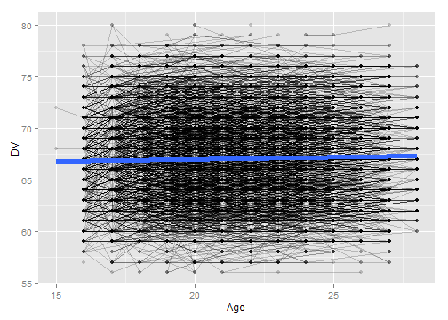
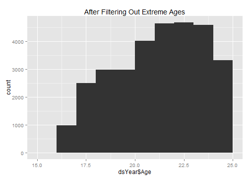
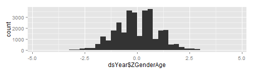
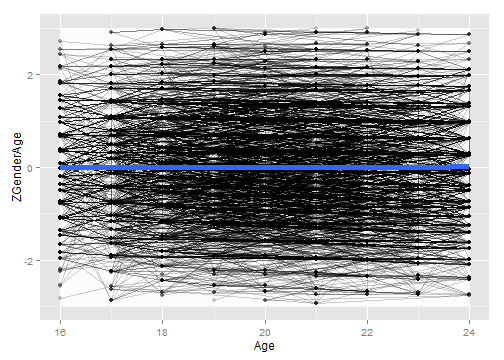

# Calculating Gen1 Height
This sequence picks a single height value per Gen2 subject.


## Define the age cutoffs to keep ages within the same Window as Gen1 Heights.  Define the height cutoffs to exclude values that are more likely to be entry errors or a developmental disorder, than a true reflection of additive genetics

```r
pathOutput <- "./ForDistribution/Outcomes/Gen1Height/Gen1Height.csv"

DVMin <- 56 #4'8"
DVMax <- 80 #7'0"
feetOnlyMin <- 4
feetOnlyMax <- 8
inchesOnlyMin <- 0
inchesOnlyMax <- 11
ageMin <- 16
ageMax <- 24
zMin <- -3
zMax <- -zMin 

extractVariablesString <- "'Gen1HeightInches'"

####################################################################################
```


## Load the appropriate information from the SQL Server database

```r
channel <- RODBC::odbcDriverConnect("driver={SQL Server}; Server=Bee\\Bass; Database=NlsLinks; Uid=NlsyReadWrite; Pwd=nophi")
dsLong <- sqlQuery(channel, 
                   paste0(
                     "SELECT * 
                      FROM [NlsLinks].[Process].[vewOutcome]
                      WHERE Generation=1 AND ItemLabel in (", extractVariablesString, ") 
                      ORDER BY SubjectTag, SurveyYear" 
                   ), stringsAsFactors=FALSE
)
dsSubject <- sqlQuery(channel, 
                      "SELECT SubjectTag 
                    FROM [NlsLinks].[Process].[tblSubject]
                    WHERE Generation=1 
                    ORDER BY SubjectTag" 
                      , stringsAsFactors=FALSE
)
dsVariable <- sqlQuery(channel,
                       paste0(
                         "SELECT * 
                      FROM [NlsLinks].[dbo].[vewVariable]
                      WHERE (Translate = 1) AND ItemLabel in (", extractVariablesString, ") 
                       ORDER BY Item, SurveyYear, VariableCode"                      
                       ), stringsAsFactors=FALSE
)
odbcClose(channel)
summary(dsLong)
```

```
   SubjectTag        SurveyYear        Item      ItemLabel             Value        LoopIndex   Generation  SurveyDate       
 Min.   :    200   Min.   :1982   Min.   :200   Length:12092       Min.   :48.0   Min.   :0   Min.   :1    Length:12092      
 1st Qu.: 316075   1st Qu.:1982   1st Qu.:200   Class :character   1st Qu.:64.0   1st Qu.:0   1st Qu.:1    Class :character  
 Median : 629350   Median :1982   Median :200   Mode  :character   Median :67.0   Median :0   Median :1    Mode  :character  
 Mean   : 631787   Mean   :1982   Mean   :200                      Mean   :67.1   Mean   :0   Mean   :1                      
 3rd Qu.: 948425   3rd Qu.:1982   3rd Qu.:200                      3rd Qu.:70.0   3rd Qu.:0   3rd Qu.:1                      
 Max.   :1268600   Max.   :1982   Max.   :200                      Max.   :83.0   Max.   :0   Max.   :1                      
 AgeSelfReportYears AgeCalculateYears     Gender   
 Min.   :17.0       Min.   :16.6      Min.   :1.0  
 1st Qu.:19.0       1st Qu.:19.4      1st Qu.:1.0  
 Median :21.0       Median :21.4      Median :1.0  
 Mean   :20.8       Mean   :21.3      Mean   :1.5  
 3rd Qu.:23.0       3rd Qu.:23.3      3rd Qu.:2.0  
 Max.   :25.0       Max.   :26.8      Max.   :2.0  
```

```r
nrow(dsSubject)
```

```
[1] 12686
```

```r

####################################################################################
```


## Make necessary Adjustments

```r
dsLong$Age <- floor(ifelse(!is.na(dsLong$AgeCalculateYears), dsLong$AgeCalculateYears, dsLong$AgeSelfReportYears)) #This could still be null.
dsLong$AgeCalculateYears <- NULL
dsLong$AgeSelfReportYears <- NULL

testit::assert("All outcomes should have a loop index of zero", all(dsLong$LoopIndex==0))
dsLong$LoopIndex <- NULL

dsYear <- dsLong[, c("SubjectTag", "SurveyYear", "Age", "Gender", "Value")]
nrow(dsYear)
```

```
[1] 12092
```

```r
rm(dsLong)

dsYear <- plyr::rename(x=dsYear, replace=c("Value"="DV"))
####################################################################################
```


## Show the height data with age of the subject when the height was taken.  Filter out records where the age or the height is outside of the desired window.

```r
#Filter out records with undesired DV values
qplot(dsYear$DV, binwidth=1, main="Before Filtering Out Extreme DV values")
```

 

```r
dsYear <- dsYear[!is.na(dsYear$DV), ]
dsYear <- dsYear[DVMin <= dsYear$DV & dsYear$DV <= DVMax, ]
nrow(dsYear)
```

```
[1] 12068
```

```r
summary(dsYear)
```

```
   SubjectTag        SurveyYear        Age           Gender          DV      
 Min.   :    200   Min.   :1982   Min.   :16.0   Min.   :1.0   Min.   :56.0  
 1st Qu.: 316375   1st Qu.:1982   1st Qu.:19.0   1st Qu.:1.0   1st Qu.:64.0  
 Median : 629350   Median :1982   Median :21.0   Median :1.0   Median :67.0  
 Mean   : 631960   Mean   :1982   Mean   :20.8   Mean   :1.5   Mean   :67.1  
 3rd Qu.: 948725   3rd Qu.:1982   3rd Qu.:23.0   3rd Qu.:2.0   3rd Qu.:70.0  
 Max.   :1268600   Max.   :1982   Max.   :26.0   Max.   :2.0   Max.   :80.0  
```

```r
qplot(dsYear$DV, binwidth=1, main="After Filtering Out Extreme DV values")
```

 

```r

#Filter out records with undesired age values
qplot(dsYear$Age, binwidth=1, main="Before Filtering Out Extreme Ages") 
```

 

```r
ggplot(dsYear, aes(x=Age, y=DV, group=SubjectTag)) + geom_line(alpha=.2) + geom_point(alpha=.2) + geom_smooth(method="rlm", aes(group=NA), size=2)
```

```
geom_path: Each group consist of only one observation. Do you need to adjust the group aesthetic?
```

 

```r
dsYear <- dsYear[!is.na(dsYear$Age), ]
dsYear <- dsYear[ageMin <= dsYear$Age & dsYear$Age <= ageMax, ]
nrow(dsYear)
```

```
[1] 11776
```

```r
qplot(dsYear$Age, binwidth=1, main="After Filtering Out Extreme Ages") 
```

 

```r
ggplot(dsYear, aes(x=Age, y=DV, group=SubjectTag)) + geom_line(alpha=.2) + geom_point(alpha=.2) + geom_smooth(method="rlm", aes(group=NA), size=2)
```

```
geom_path: Each group consist of only one observation. Do you need to adjust the group aesthetic?
```

 

```r

####################################################################################
```

## Standardize by Gender & Age.  Calculated Age (using SurveyDate and MOB) has been truncated to integers.  

```r
# dsYear <- ddply(dsYear, c("Gender"), transform, ZGender=scale(DV))
dsYear <- ddply(dsYear, c("Gender", "Age"), transform, ZGenderAge=scale(DV))
nrow(dsYear)
```

```
[1] 11776
```

```r
qplot(dsYear$ZGenderAge, binwidth=.25)
```

 

```r

####################################################################################
```


## Determine Z-score to clip at.  Adjust as necessary (zMin & zMax were defined at the top of the page).  The white box extends between zMin and zMax.

```r
ggplot(dsYear, aes(x=Age, y=ZGenderAge, group=SubjectTag)) + 
  annotate("rect", xmin=min(dsYear$Age), xmax=max(dsYear$Age), ymin=zMin, ymax= zMax, fill="gray99") +
  geom_line(alpha=.2) + geom_point(alpha=.2) + geom_smooth(method="rlm", aes(group=NA), size=2)
```

```
geom_path: Each group consist of only one observation. Do you need to adjust the group aesthetic?
```

 

```r
dsYear <- dsYear[zMin <= dsYear$ZGenderAge & dsYear$ZGenderAge <= zMax, ]
nrow(dsYear)
```

```
[1] 11748
```

```r
ggplot(dsYear, aes(x=Age, y=ZGenderAge, group=SubjectTag)) + 
  annotate("rect", xmin=min(dsYear$Age), xmax=max(dsYear$Age), ymin=zMin, ymax= zMax, fill="gray99") +
  geom_line(alpha=.2) + geom_point(alpha=.2) + geom_smooth(method="rlm", aes(group=NA), size=2)
```

```
geom_path: Each group consist of only one observation. Do you need to adjust the group aesthetic?
```

 

```r

####################################################################################
```


## Pick the subject's oldest record (within that age window).  Then examine the age & Z values

```r
ds <- ddply(dsYear, "SubjectTag", subset, rank(-Age)==1)
nrow(ds) 
```

```
[1] 11748
```

```r
summary(ds)
```

```
   SubjectTag        SurveyYear        Age           Gender          DV         ZGenderAge     
 Min.   :    200   Min.   :1982   Min.   :16.0   Min.   :1.0   Min.   :56.0   Min.   :-2.9620  
 1st Qu.: 315375   1st Qu.:1982   1st Qu.:19.0   1st Qu.:1.0   1st Qu.:64.0   1st Qu.:-0.7553  
 Median : 626450   Median :1982   Median :21.0   Median :1.0   Median :67.0   Median :-0.0533  
 Mean   : 630444   Mean   :1982   Mean   :20.7   Mean   :1.5   Mean   :67.1   Mean   : 0.0028  
 3rd Qu.: 946425   3rd Qu.:1982   3rd Qu.:23.0   3rd Qu.:2.0   3rd Qu.:70.0   3rd Qu.: 0.6813  
 Max.   :1268600   Max.   :1982   Max.   :24.0   Max.   :2.0   Max.   :79.0   Max.   : 2.9719  
```

```r
# SELECT [Mob], [LastSurveyYearCompleted], [AgeAtLastSurvey]
#   FROM [NlsLinks].[dbo].[vewSubjectDetails79]
#   WHERE Generation=2 and AgeAtLastSurvey >=16
#After the 2010 survey, there were 7,201 subjects who were at least 16 at the last survey.
ds <- plyr::join(x=dsSubject, y=ds, by="SubjectTag", type="left", match="first")
nrow(ds) 
```

```
[1] 12686
```

```r

qplot(ds$Age, binwidth=.5) #Make sure ages are within window, and favoring older values
```

 

```r
qplot(ds$ZGenderAge, binwidth=.25)
```

 

```r
table(is.na(ds$ZGenderAge))
```

```

FALSE  TRUE 
11748   938 
```

```r

####################################################################################
```


## Write the OutcomeData to CSV

```r
write.csv(ds, pathOutput, row.names=FALSE)

####################################################################################
```


## NLSY Variables
Each row in the table represents and NLSY variable that was used.  The first column is the official "R Number" designated by the NLSY.  The remaining columns are values we assigned to help the plumbing and data manipulation.

```r
dsVariable[, c("VariableCode", "SurveyYear", "Item", "ItemLabel", "Generation", "ExtractSource", "ID")]
```

```
  VariableCode SurveyYear Item        ItemLabel Generation ExtractSource   ID
1     R0779800       1982  200 Gen1HeightInches          1             8 1889
```

