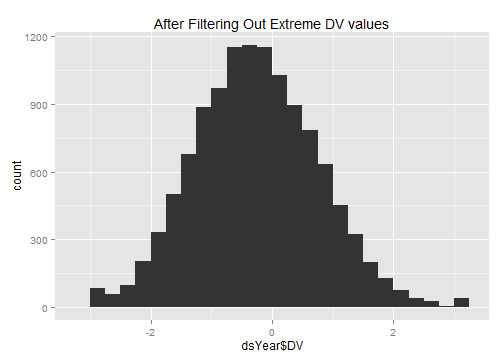
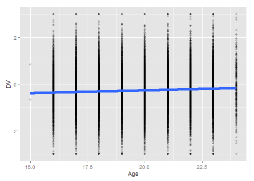
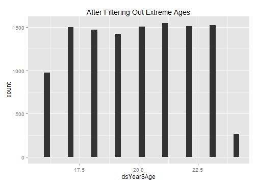
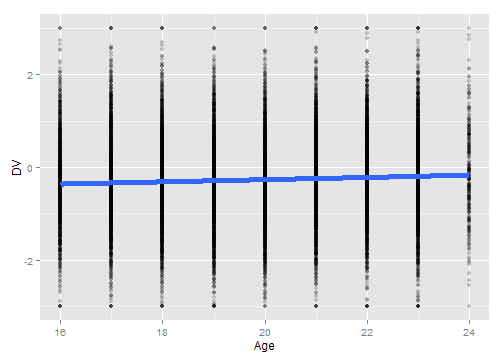
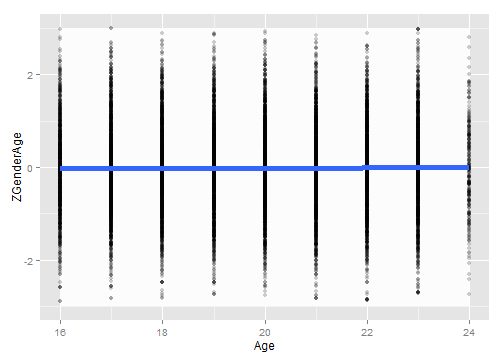
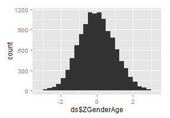

# Calculating Gen1 IQ
This sequence picks a single IQ value per Gen1 subject.


## Define the age cutoffs to keep ages within the same Window as Gen1 IQ.  Define the IQ cutoffs to exclude values that are more likely to be entry errors or a developmental disorder, than a true reflection of additive genetics

```r
pathOutput <- "./ForDistribution/Outcomes/Gen1IQ/Gen1IQ.csv"

DVMin <- -10
DVMax <- 10
feetOnlyMin <- 4
feetOnlyMax <- 8
inchesOnlyMin <- 0
inchesOnlyMax <- 11
ageMin <- 16
ageMax <- 24
zMin <- -3
zMax <- -zMin 

extractVariablesString <- "'Gen1AfqtScaled3Decimals'"

####################################################################################
```


## Load the appropriate information from the SQL Server database

```r
dsExtract <- read.csv(file="D:/Projects/BG/Links2011/NlsyLinksDetermination/Extracts/Gen1Outcomes.csv", stringsAsFactors=F)

channel <- RODBC::odbcDriverConnect("driver={SQL Server}; Server=Bee\\Bass; Database=NlsLinks; Uid=NlsyReadWrite; Pwd=nophi")
dsLong <- sqlQuery(channel, paste0(
  "SELECT * 
  FROM [NlsLinks].[Process].[vewOutcome]
  WHERE Generation=1 AND ItemLabel in (", extractVariablesString, ") 
  ORDER BY SubjectTag, SurveyYear" 
  ), stringsAsFactors=FALSE
)


dsSubject <- sqlQuery(channel, 
  "SELECT SubjectTag 
  FROM [NlsLinks].[Process].[tblSubject]
  WHERE Generation=1 
  ORDER BY SubjectTag" 
  , stringsAsFactors=FALSE
)
dsVariable <- sqlQuery(channel, paste0(
  "SELECT * 
  FROM [NlsLinks].[dbo].[vewVariable]
  WHERE (Translate = 1) AND ItemLabel in (", extractVariablesString, ") 
  ORDER BY Item, SurveyYear, VariableCode"                      
  ), stringsAsFactors=FALSE
)
odbcClose(channel)
summary(dsLong)
```

```
   SubjectTag        SurveyYear        Item      ItemLabel             Value          LoopIndex   Generation  SurveyDate       
 Min.   :    200   Min.   :1981   Min.   :203   Length:11914       Min.   :     0   Min.   :0   Min.   :1    Length:11914      
 1st Qu.: 316625   1st Qu.:1981   1st Qu.:203   Class :character   1st Qu.: 16772   1st Qu.:0   1st Qu.:1    Class :character  
 Median : 630650   Median :1981   Median :203   Mode  :character   Median : 38624   Median :0   Median :1    Mode  :character  
 Mean   : 631985   Mean   :1981   Mean   :203                      Mean   : 42396   Mean   :0   Mean   :1                      
 3rd Qu.: 945475   3rd Qu.:1981   3rd Qu.:203                      3rd Qu.: 66290   3rd Qu.:0   3rd Qu.:1                      
 Max.   :1268600   Max.   :1981   Max.   :203                      Max.   :100000   Max.   :0   Max.   :1                      
                                                                                                                               
 AgeSelfReportYears AgeCalculateYears     Gender   
 Min.   :16.0       Min.   :15.6      Min.   :1.0  
 1st Qu.:18.0       1st Qu.:18.3      1st Qu.:1.0  
 Median :20.0       Median :20.3      Median :1.0  
 Mean   :19.8       Mean   :20.3      Mean   :1.5  
 3rd Qu.:22.0       3rd Qu.:22.2      3rd Qu.:2.0  
 Max.   :24.0       Max.   :24.7      Max.   :2.0  
 NA's   :193        NA's   :193                    
```

```r
nrow(dsSubject)
```

```
[1] 12686
```

```r


# Compare
dsExtract$SubjectTag <- dsExtract$R0000100*100
dsExtract$DV <- dsExtract$R0618301
dsExtract$DV <- ifelse(dsExtract$DV<0, NA, dsExtract$DV)
dsCompare <- merge(x=dsExtract, y=dsLong, by="SubjectTag", all=TRUE)


qplot(dsCompare$DV, dsCompare$Value)
```

```
Warning: Removed 772 rows containing missing values (geom_point).
```

 

```r
table(!is.na(dsCompare$DV), !is.na(dsCompare$Value))
```

```
       
        FALSE  TRUE
  FALSE   772     0
  TRUE      0 11914
```

```r


####################################################################################
```


## Make necessary Adjustments

```r
dsLong$Age <- floor(ifelse(!is.na(dsLong$AgeCalculateYears), dsLong$AgeCalculateYears, dsLong$AgeSelfReportYears)) #This could still be null.
dsLong$AgeCalculateYears <- NULL
dsLong$AgeSelfReportYears <- NULL

testit::assert("All outcomes should have a loop index of zero", all(dsLong$LoopIndex==0))
dsLong$LoopIndex <- NULL

#The NLS Investigator can return only integers, so it multiplied everything by 10000.  See R06183.01.
#   Then I divide by 100 again to convert it to a proportion.
dsLong$Value <- dsLong$Value/(1000 * 100)
dsYear <- dsLong[, c("SubjectTag", "SurveyYear", "Age", "Gender", "Value")]
nrow(dsYear)
```

```
[1] 11914
```

```r
rm(dsLong)

####################################################################################
```


## Convert the proportions into Z scores, if desired

```r
qplot(dsYear$Value, binwidth=.05, main="Before Gaussification")
```

 

```r

dsYear$AfqtRescaled2006Gaussified <- qnorm(dsYear$Value) #convert from roughly uniform distribution [0, 100], to something Gaussianish.
dsYear$AfqtRescaled2006Gaussified <- pmax(pmin(dsYear$AfqtRescaled2006Gaussified, 3), -3) #The scale above had 0s and 100s, so clamp that in at +/-3.
dsYear <- plyr::rename(x=dsYear, replace=c("AfqtRescaled2006Gaussified"="DV"))

# dsYear <- plyr::rename(x=dsYear, replace=c("Value"="DV"))


####################################################################################
```


## Show the IQ data with age of the subject when the IQ was taken.  Filter out records where the age or the IQ is outside of the desired window.

```r
#Filter out records with undesired DV values
qplot(dsYear$DV, binwidth=.25, main="Before Filtering Out Extreme DV values")
```

 

```r
dsYear <- dsYear[!is.na(dsYear$DV), ]
dsYear <- dsYear[DVMin <= dsYear$DV & dsYear$DV <= DVMax, ]
nrow(dsYear)
```

```
[1] 11914
```

```r
summary(dsYear)
```

```
   SubjectTag        SurveyYear        Age           Gender        Value             DV        
 Min.   :    200   Min.   :1981   Min.   :15.0   Min.   :1.0   Min.   :0.000   Min.   :-3.000  
 1st Qu.: 316625   1st Qu.:1981   1st Qu.:18.0   1st Qu.:1.0   1st Qu.:0.168   1st Qu.:-0.963  
 Median : 630650   Median :1981   Median :20.0   Median :1.0   Median :0.386   Median :-0.289  
 Mean   : 631985   Mean   :1981   Mean   :19.8   Mean   :1.5   Mean   :0.424   Mean   :-0.262  
 3rd Qu.: 945475   3rd Qu.:1981   3rd Qu.:22.0   3rd Qu.:2.0   3rd Qu.:0.663   3rd Qu.: 0.420  
 Max.   :1268600   Max.   :1981   Max.   :24.0   Max.   :2.0   Max.   :1.000   Max.   : 3.000  
                                  NA's   :193                                                  
```

```r
qplot(dsYear$DV, binwidth=.25, main="After Filtering Out Extreme DV values")
```

 

```r

#Filter out records with undesired age values
qplot(dsYear$Age, binwidth=.25, main="Before Filtering Out Extreme Ages") 
```

 

```r
ggplot(dsYear, aes(x=Age, y=DV, group=SubjectTag)) + geom_line(alpha=.2) + geom_point(alpha=.2) + geom_smooth(method="rlm", aes(group=NA), size=2)
```

```
Warning: Removed 193 rows containing missing values (stat_smooth).
```

```
geom_path: Each group consist of only one observation. Do you need to adjust the group aesthetic?
```

```
Warning: Removed 193 rows containing missing values (geom_point).
```

 

```r
dsYear <- dsYear[!is.na(dsYear$Age), ]
dsYear <- dsYear[ageMin <= dsYear$Age & dsYear$Age <= ageMax, ]
nrow(dsYear)
```

```
[1] 11719
```

```r
qplot(dsYear$Age, binwidth=.25, main="After Filtering Out Extreme Ages") 
```

 

```r
ggplot(dsYear, aes(x=Age, y=DV, group=SubjectTag)) + geom_line(alpha=.2) + geom_point(alpha=.2) + geom_smooth(method="rlm", aes(group=NA), size=2)
```

```
geom_path: Each group consist of only one observation. Do you need to adjust the group aesthetic?
```

 

```r

####################################################################################
```


## Standardize by Gender & Age.  Calculated Age (using SurveyDate and MOB) has been truncated to integers.  

```r
# dsYear <- ddply(dsYear, c("Gender"), transform, ZGenderAge=scale(DV))  #WATCH OUT-This is a quick hack with age.
dsYear <- ddply(dsYear, c("Gender", "Age"), transform, ZGenderAge=scale(DV))
# dsYear$ZGenderAge <- dsYear$DV
nrow(dsYear)
```

```
[1] 11719
```

```r
qplot(dsYear$ZGenderAge, binwidth=.25)
```

 

```r


# dsYear$ZGenderAge <- rnorm(n=nrow(dsYear))

####################################################################################
```


## Determine Z-score to clip at.  Adjust as necessary (zMin & zMax were defined at the top of the page).  The white box extends between zMin and zMax.

```r
ggplot(dsYear, aes(x=Age, y=ZGenderAge, group=SubjectTag)) + 
  annotate("rect", xmin=min(dsYear$Age), xmax=max(dsYear$Age), ymin=zMin, ymax= zMax, fill="gray99") +
  geom_line(alpha=.2) + geom_point(alpha=.2) + geom_smooth(method="rlm", aes(group=NA), size=2)
```

```
geom_path: Each group consist of only one observation. Do you need to adjust the group aesthetic?
```

 

```r
dsYear <- dsYear[zMin <= dsYear$ZGenderAge & dsYear$ZGenderAge <= zMax, ]
nrow(dsYear)
```

```
[1] 11680
```

```r
ggplot(dsYear, aes(x=Age, y=ZGenderAge, group=SubjectTag)) + 
  annotate("rect", xmin=min(dsYear$Age), xmax=max(dsYear$Age), ymin=zMin, ymax= zMax, fill="gray99") +
  geom_line(alpha=.2) + geom_point(alpha=.2) + geom_smooth(method="rlm", aes(group=NA), size=2)
```

```
geom_path: Each group consist of only one observation. Do you need to adjust the group aesthetic?
```

 

```r

####################################################################################
```


## Pick the subject's oldest record (within that age window).  Then examine the age & Z values

```r
#The ASFT was asked only once of the Gen1 subjects, so I don't need to reduce.
ds <- dsYear

ds <- plyr::join(x=dsSubject, y=ds, by="SubjectTag", type="left", match="first")
nrow(ds) 
```

```
[1] 12686
```

```r

qplot(ds$Age, binwidth=.5) #Make sure ages are within window, and favoring older values
```

 

```r
qplot(ds$ZGenderAge, binwidth=.25)
```

 

```r
table(is.na(ds$ZGenderAge))
```

```

FALSE  TRUE 
11680  1006 
```

```r

####################################################################################
```


## Write the OutcomeData to CSV

```r
write.csv(ds, pathOutput, row.names=FALSE)

####################################################################################
```


## NLSY Variables
Each row in the table represents and NLSY variable that was used.  The first column is the official "R Number" designated by the NLSY.  The remaining columns are values we assigned to help the plumbing and data manipulation.

```r
dsVariable[, c("VariableCode", "SurveyYear", "Item", "ItemLabel", "Generation", "ExtractSource", "ID")]
```

```
  VariableCode SurveyYear Item               ItemLabel Generation ExtractSource   ID
1     R0618301       1981  203 Gen1AfqtScaled3Decimals          1             8 1912
```

