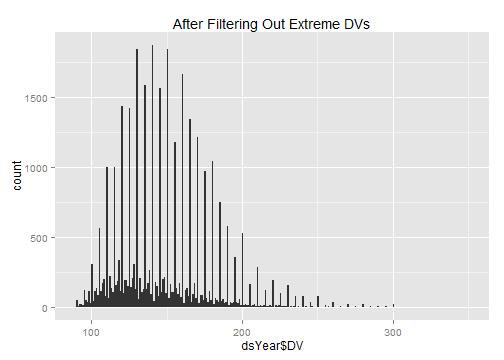

# Calculating Gen1 Weight
This sequence picks a single Weight value per Gen2 subject.


## Define the age cutoffs to keep ages within the same Window as Gen1 Weights.  Define the Weight cutoffs to exclude values that are more likely to be entry errors or a developmental disorder, than a true reflection of additive genetics

```r
pathOutput <- "./ForDistribution/Outcomes/Gen1Weight/Gen1Weight.csv"

poundsMin <- 90 
poundsMax <- 350 

ageMin <- 16
ageMax <- 24
zMin <- -3
zMax <- -zMin 


####################################################################################
```


## Load the appropriate information from the SQL Server database

```r
channel <- RODBC::odbcDriverConnect("driver={SQL Server}; Server=Bee\\Bass; Database=NlsLinks; Uid=NlsyReadWrite; Pwd=nophi")
dsLong <- sqlQuery(channel, 
                   "SELECT * 
                    FROM [NlsLinks].[Process].[vewOutcome]
                    WHERE Generation=1 AND ItemLabel in ('Gen1WeightPounds') 
                    ORDER BY SubjectTag, SurveyYear" 
                   , stringsAsFactors=FALSE
)
dsSubject <- sqlQuery(channel, 
                    "SELECT SubjectTag 
                    FROM [NlsLinks].[Process].[tblSubject]
                    WHERE Generation=1 
                    ORDER BY SubjectTag" 
                    , stringsAsFactors=FALSE
)
odbcClose(channel)
summary(dsLong)
```

```
   SubjectTag        SurveyYear        Item      ItemLabel        
 Min.   :    200   Min.   :1982   Min.   :201   Length:12086      
 1st Qu.: 316225   1st Qu.:1982   1st Qu.:201   Class :character  
 Median : 629650   Median :1982   Median :201   Mode  :character  
 Mean   : 631966   Mean   :1982   Mean   :201                     
 3rd Qu.: 948675   3rd Qu.:1982   3rd Qu.:201                     
 Max.   :1268600   Max.   :1982   Max.   :201                     
     Value       LoopIndex   Generation  SurveyDate        AgeSelfReportYears
 Min.   : 53   Min.   :0   Min.   :1    Length:12086       Min.   :17.0      
 1st Qu.:125   1st Qu.:0   1st Qu.:1    Class :character   1st Qu.:19.0      
 Median :145   Median :0   Median :1    Mode  :character   Median :21.0      
 Mean   :148   Mean   :0   Mean   :1                       Mean   :20.8      
 3rd Qu.:165   3rd Qu.:0   3rd Qu.:1                       3rd Qu.:23.0      
 Max.   :350   Max.   :0   Max.   :1                       Max.   :25.0      
 AgeCalculateYears     Gender   
 Min.   :16.6      Min.   :1.0  
 1st Qu.:19.4      1st Qu.:1.0  
 Median :21.4      Median :1.0  
 Mean   :21.3      Mean   :1.5  
 3rd Qu.:23.3      3rd Qu.:2.0  
 Max.   :26.8      Max.   :2.0  
```

```r
nrow(dsSubject)
```

```
[1] 12686
```

```r

####################################################################################
```


## Make necessary Adjustments

```r
dsLong$Age <- floor(ifelse(!is.na(dsLong$AgeCalculateYears), dsLong$AgeCalculateYears, dsLong$AgeSelfReportYears)) #This could still be null.
dsLong$AgeCalculateYears <- NULL
dsLong$AgeSelfReportYears <- NULL

testit::assert("All outcomes should have a loop index of zero", all(dsLong$LoopIndex==0))
dsLong$LoopIndex <- NULL

dsYear <- dsLong[, c("SubjectTag", "SurveyYear", "Age", "Gender", "Value")]
nrow(dsYear)
```

```
[1] 12086
```

```r
rm(dsLong)

dsYear <- plyr::rename(x=dsYear, replace=c("Value"="Pounds"))
####################################################################################
```


## Show the Weight data with age of the subject when the Weight was taken.  Filter out records where the age or the Weight is outside of the desired window.

```r
#Filter out records with undesired Weight values
qplot(dsYear$Pounds, binwidth=1, main="Before Filtering Out Extreme Weights") #Make sure ages are normalish with no extreme values.
```

 

```r
dsYear <- dsYear[!is.na(dsYear$Pounds), ]
dsYear <- dsYear[poundsMin <= dsYear$Pounds & dsYear$Pounds <= poundsMax, ]
nrow(dsYear)
```

```
[1] 12086
```

```r
summary(dsYear)
```

```
   SubjectTag        SurveyYear        Age           Gender        Pounds   
 Min.   :    200   Min.   :1982   Min.   :16.0   Min.   :1.0   Min.   : 53  
 1st Qu.: 316225   1st Qu.:1982   1st Qu.:19.0   1st Qu.:1.0   1st Qu.:125  
 Median : 629650   Median :1982   Median :21.0   Median :1.0   Median :145  
 Mean   : 631966   Mean   :1982   Mean   :20.8   Mean   :1.5   Mean   :148  
 3rd Qu.: 948675   3rd Qu.:1982   3rd Qu.:23.0   3rd Qu.:2.0   3rd Qu.:165  
 Max.   :1268600   Max.   :1982   Max.   :26.0   Max.   :2.0   Max.   :350  
```

```r
qplot(dsYear$Pounds, binwidth=1, main="After Filtering Out Extreme Weights") #Make sure ages are normalish with no extreme values.
```

 

```r

#Filter out records with undesired age values
ggplot(dsYear, aes(x=Age, y=Pounds, group=SubjectTag)) + geom_line(alpha=.2) + geom_point(alpha=.2) + geom_smooth(method="rlm", aes(group=NA), size=2)
```

```
geom_path: Each group consist of only one observation. Do you need to adjust the group aesthetic?
```

 

```r
dsYear <- dsYear[!is.na(dsYear$Age), ]
dsYear <- dsYear[ageMin <= dsYear$Age & dsYear$Age <= ageMax, ]
nrow(dsYear)
```

```
[1] 11793
```

```r
ggplot(dsYear, aes(x=Age, y=Pounds, group=SubjectTag)) + geom_line(alpha=.2) + geom_point(alpha=.2) + geom_smooth(method="rlm", aes(group=NA), size=2)
```

```
geom_path: Each group consist of only one observation. Do you need to adjust the group aesthetic?
```

 

```r

####################################################################################
```

## Standardize by Gender & Age.  Calculated Age (using SurveyDate and MOB) has been truncated to integers.  

```r
dsYear <- ddply(dsYear, c("Gender"), transform, WeightZGender=scale(Pounds))
dsYear <- ddply(dsYear, c("Gender", "Age"), transform, WeightZGenderAge=scale(Pounds))
nrow(dsYear)
```

```
[1] 11793
```

```r
qplot(dsYear$WeightZGenderAge, binwidth=.25) #Make sure ages are normalish with no extreme values.
```

 

```r

####################################################################################
```


## Determine Z-score to clip at.  Adjust as necessary (zMin & zMax were defined at the top of the page).  The white box extends between zMin and zMax.

```r
ggplot(dsYear, aes(x=Age, y=WeightZGenderAge, group=SubjectTag)) + 
  annotate("rect", xmin=min(dsYear$Age), xmax=max(dsYear$Age), ymin=zMin, ymax= zMax, fill="gray99") +
  geom_line(alpha=.2) + geom_point(alpha=.2) + geom_smooth(method="rlm", aes(group=NA), size=2)
```

```
geom_path: Each group consist of only one observation. Do you need to adjust the group aesthetic?
```

 

```r
dsYear <- dsYear[zMin <= dsYear$WeightZGenderAge & dsYear$WeightZGenderAge <= zMax, ]
nrow(dsYear)
```

```
[1] 11645
```

```r
ggplot(dsYear, aes(x=Age, y=WeightZGenderAge, group=SubjectTag)) + 
  annotate("rect", xmin=min(dsYear$Age), xmax=max(dsYear$Age), ymin=zMin, ymax= zMax, fill="gray99") +
  geom_line(alpha=.2) + geom_point(alpha=.2) + geom_smooth(method="rlm", aes(group=NA), size=2)
```

```
geom_path: Each group consist of only one observation. Do you need to adjust the group aesthetic?
```

 

```r

####################################################################################
```


## Pick the subject's oldest record (within that age window).  Then examine the age & Z values

```r
ds <- ddply(dsYear, "SubjectTag", subset, rank(-Age)==1)
nrow(ds) 
```

```
[1] 11645
```

```r
summary(ds)
```

```
   SubjectTag        SurveyYear        Age           Gender        Pounds   
 Min.   :    200   Min.   :1982   Min.   :16.0   Min.   :1.0   Min.   : 70  
 1st Qu.: 316200   1st Qu.:1982   1st Qu.:19.0   1st Qu.:1.0   1st Qu.:125  
 Median : 627700   Median :1982   Median :21.0   Median :1.0   Median :145  
 Mean   : 630932   Mean   :1982   Mean   :20.7   Mean   :1.5   Mean   :146  
 3rd Qu.: 947000   3rd Qu.:1982   3rd Qu.:23.0   3rd Qu.:2.0   3rd Qu.:165  
 Max.   :1268600   Max.   :1982   Max.   :24.0   Max.   :2.0   Max.   :250  
 WeightZGender    WeightZGenderAge
 Min.   :-2.750   Min.   :-2.722  
 1st Qu.:-0.669   1st Qu.:-0.685  
 Median :-0.136   Median :-0.171  
 Mean   :-0.049   Mean   :-0.049  
 3rd Qu.: 0.424   3rd Qu.: 0.460  
 Max.   : 3.380   Max.   : 2.998  
```

```r
# SELECT [Mob], [LastSurveyYearCompleted], [AgeAtLastSurvey]
#   FROM [NlsLinks].[dbo].[vewSubjectDetails79]
#   WHERE Generation=2 and AgeAtLastSurvey >=16
#After the 2010 survey, there were 7,201 subjects who were at least 16 at the last survey.
ds <- plyr::join(x=dsSubject, y=ds, by="SubjectTag", type="left", match="first")
nrow(ds) 
```

```
[1] 12686
```

```r

qplot(ds$Age, binwidth=.5) #Make sure ages are within window, and favoring older values
```

 

```r
qplot(ds$WeightZGenderAge, binwidth=.25) #Make sure ages are normalish with no extreme values.
```

 

```r

####################################################################################
```


## Write the OutcomeData to CSV

```r
write.csv(ds, pathOutput, row.names=FALSE)
```

