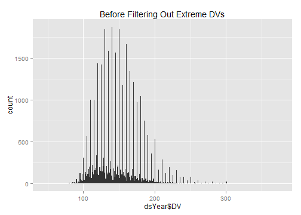
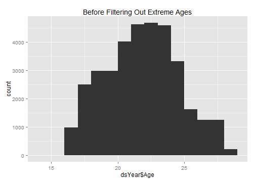
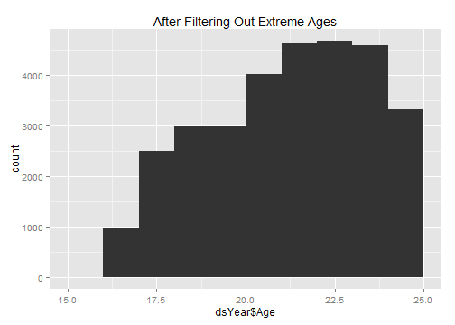
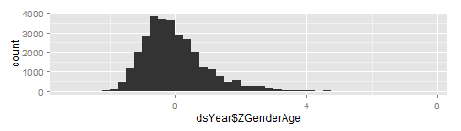
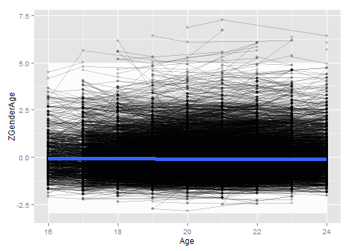
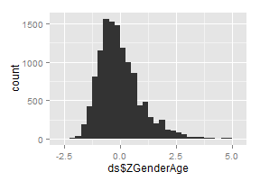

# Calculating Gen1 Weight
This sequence picks a single Weight value per Gen2 subject.


## Define the age cutoffs to keep ages within the same Window as Gen1 Weights.  Define the Weight cutoffs to exclude values that are more likely to be entry errors or a developmental disorder, than a true reflection of additive genetics

```r
pathOutput <- "./ForDistribution/Outcomes/Gen1Weight/Gen1Weight.csv"

DVMin <- 90 
DVMax <- 350 

ageMin <- 16
ageMax <- 24
zMin <- -3
zMax <- -zMin 

extractVariablesString <- "'Gen1WeightPounds'"

####################################################################################
```


## Load the appropriate information from the SQL Server database

```r
channel <- RODBC::odbcDriverConnect("driver={SQL Server}; Server=Bee\\Bass; Database=NlsLinks; Uid=NlsyReadWrite; Pwd=nophi")
dsLong <- sqlQuery(channel, 
                   paste0(
                     "SELECT * 
                      FROM [NlsLinks].[Process].[vewOutcome]
                      WHERE Generation=1 AND ItemLabel in (", extractVariablesString, ") 
                      ORDER BY SubjectTag, SurveyYear" 
                   ), stringsAsFactors=FALSE
)
dsSubject <- sqlQuery(channel, 
                      "SELECT SubjectTag 
                    FROM [NlsLinks].[Process].[tblSubject]
                    WHERE Generation=1 
                    ORDER BY SubjectTag" 
                      , stringsAsFactors=FALSE
)
dsVariable <- sqlQuery(channel,
                       paste0(
                         "SELECT * 
                      FROM [NlsLinks].[dbo].[vewVariable]
                      WHERE (Translate = 1) AND ItemLabel in (", extractVariablesString, ") 
                       ORDER BY Item, SurveyYear, VariableCode"                      
                       ), stringsAsFactors=FALSE
)
odbcClose(channel)
summary(dsLong)
```

```
   SubjectTag        SurveyYear        Item      ItemLabel             Value       LoopIndex   Generation  SurveyDate       
 Min.   :    200   Min.   :1982   Min.   :201   Length:12086       Min.   : 53   Min.   :0   Min.   :1    Length:12086      
 1st Qu.: 316225   1st Qu.:1982   1st Qu.:201   Class :character   1st Qu.:125   1st Qu.:0   1st Qu.:1    Class :character  
 Median : 629650   Median :1982   Median :201   Mode  :character   Median :145   Median :0   Median :1    Mode  :character  
 Mean   : 631966   Mean   :1982   Mean   :201                      Mean   :148   Mean   :0   Mean   :1                      
 3rd Qu.: 948675   3rd Qu.:1982   3rd Qu.:201                      3rd Qu.:165   3rd Qu.:0   3rd Qu.:1                      
 Max.   :1268600   Max.   :1982   Max.   :201                      Max.   :350   Max.   :0   Max.   :1                      
 AgeSelfReportYears AgeCalculateYears     Gender   
 Min.   :17.0       Min.   :16.6      Min.   :1.0  
 1st Qu.:19.0       1st Qu.:19.4      1st Qu.:1.0  
 Median :21.0       Median :21.4      Median :1.0  
 Mean   :20.8       Mean   :21.3      Mean   :1.5  
 3rd Qu.:23.0       3rd Qu.:23.3      3rd Qu.:2.0  
 Max.   :25.0       Max.   :26.8      Max.   :2.0  
```

```r
nrow(dsSubject)
```

```
[1] 12686
```

```r

####################################################################################
```


## Make necessary Adjustments

```r
dsLong$Age <- floor(ifelse(!is.na(dsLong$AgeCalculateYears), dsLong$AgeCalculateYears, dsLong$AgeSelfReportYears)) #This could still be null.
dsLong$AgeCalculateYears <- NULL
dsLong$AgeSelfReportYears <- NULL

testit::assert("All outcomes should have a loop index of zero", all(dsLong$LoopIndex==0))
dsLong$LoopIndex <- NULL

dsYear <- dsLong[, c("SubjectTag", "SurveyYear", "Age", "Gender", "Value")]
nrow(dsYear)
```

```
[1] 12086
```

```r
rm(dsLong)

dsYear <- plyr::rename(x=dsYear, replace=c("Value"="DV"))
####################################################################################
```


## Show the Weight data with age of the subject when the Weight was taken.  Filter out records where the age or the Weight is outside of the desired window.

```r
#Filter out records with undesired DV values
qplot(dsYear$DV, binwidth=1, main="Before Filtering Out Extreme DVs")
```

 

```r
dsYear <- dsYear[!is.na(dsYear$DV), ]
dsYear <- dsYear[DVMin <= dsYear$DV & dsYear$DV <= DVMax, ]
nrow(dsYear)
```

```
[1] 12063
```

```r
summary(dsYear)
```

```
   SubjectTag        SurveyYear        Age           Gender          DV     
 Min.   :    200   Min.   :1982   Min.   :16.0   Min.   :1.0   Min.   : 90  
 1st Qu.: 316150   1st Qu.:1982   1st Qu.:19.0   1st Qu.:1.0   1st Qu.:125  
 Median : 629500   Median :1982   Median :21.0   Median :1.0   Median :145  
 Mean   : 631958   Mean   :1982   Mean   :20.8   Mean   :1.5   Mean   :148  
 3rd Qu.: 948750   3rd Qu.:1982   3rd Qu.:23.0   3rd Qu.:2.0   3rd Qu.:165  
 Max.   :1268600   Max.   :1982   Max.   :26.0   Max.   :2.0   Max.   :350  
```

```r
qplot(dsYear$DV, binwidth=1, main="After Filtering Out Extreme DVs") 
```

 

```r

#Filter out records with undesired age values
qplot(dsYear$Age, binwidth=1, main="Before Filtering Out Extreme Ages") 
```

 

```r
ggplot(dsYear, aes(x=Age, y=DV, group=SubjectTag)) + geom_line(alpha=.2) + geom_point(alpha=.2) + geom_smooth(method="rlm", aes(group=NA), size=2)
```

```
geom_path: Each group consist of only one observation. Do you need to adjust the group aesthetic?
```

 

```r
dsYear <- dsYear[!is.na(dsYear$Age), ]
dsYear <- dsYear[ageMin <= dsYear$Age & dsYear$Age <= ageMax, ]
nrow(dsYear)
```

```
[1] 11770
```

```r
qplot(dsYear$Age, binwidth=1, main="After Filtering Out Extreme Ages") 
```

 

```r
ggplot(dsYear, aes(x=Age, y=DV, group=SubjectTag)) + geom_line(alpha=.2) + geom_point(alpha=.2) + geom_smooth(method="rlm", aes(group=NA), size=2)
```

```
geom_path: Each group consist of only one observation. Do you need to adjust the group aesthetic?
```

 

```r

####################################################################################
```

## Standardize by Gender & Age.  Calculated Age (using SurveyDate and MOB) has been truncated to integers.  

```r
# dsYear <- ddply(dsYear, c("Gender"), transform, ZGender=scale(DV))
dsYear <- ddply(dsYear, c("Gender", "Age"), transform, ZGenderAge=scale(DV))
nrow(dsYear)
```

```
[1] 11770
```

```r
qplot(dsYear$ZGenderAge, binwidth=.25) 
```

 

```r

####################################################################################
```


## Determine Z-score to clip at.  Adjust as necessary (zMin & zMax were defined at the top of the page).  The white box extends between zMin and zMax.

```r
ggplot(dsYear, aes(x=Age, y=ZGenderAge, group=SubjectTag)) + 
  annotate("rect", xmin=min(dsYear$Age), xmax=max(dsYear$Age), ymin=zMin, ymax= zMax, fill="gray99") +
  geom_line(alpha=.2) + geom_point(alpha=.2) + geom_smooth(method="rlm", aes(group=NA), size=2)
```

```
geom_path: Each group consist of only one observation. Do you need to adjust the group aesthetic?
```

 

```r
dsYear <- dsYear[zMin <= dsYear$ZGenderAge & dsYear$ZGenderAge <= zMax, ]
nrow(dsYear)
```

```
[1] 11621
```

```r
ggplot(dsYear, aes(x=Age, y=ZGenderAge, group=SubjectTag)) + 
  annotate("rect", xmin=min(dsYear$Age), xmax=max(dsYear$Age), ymin=zMin, ymax= zMax, fill="gray99") +
  geom_line(alpha=.2) + geom_point(alpha=.2) + geom_smooth(method="rlm", aes(group=NA), size=2)
```

```
geom_path: Each group consist of only one observation. Do you need to adjust the group aesthetic?
```

 

```r

####################################################################################
```


## Pick the subject's oldest record (within that age window).  Then examine the age & Z values

```r
ds <- ddply(dsYear, "SubjectTag", subset, rank(-Age)==1)
nrow(ds) 
```

```
[1] 11621
```

```r
summary(ds)
```

```
   SubjectTag        SurveyYear        Age           Gender          DV        ZGenderAge     
 Min.   :    200   Min.   :1982   Min.   :16.0   Min.   :1.0   Min.   : 90   Min.   :-2.7219  
 1st Qu.: 316100   1st Qu.:1982   1st Qu.:19.0   1st Qu.:1.0   1st Qu.:125   1st Qu.:-0.6894  
 Median : 627600   Median :1982   Median :21.0   Median :1.0   Median :145   Median :-0.1711  
 Mean   : 630888   Mean   :1982   Mean   :20.7   Mean   :1.5   Mean   :146   Mean   :-0.0506  
 3rd Qu.: 947100   3rd Qu.:1982   3rd Qu.:23.0   3rd Qu.:2.0   3rd Qu.:165   3rd Qu.: 0.4530  
 Max.   :1268600   Max.   :1982   Max.   :24.0   Max.   :2.0   Max.   :250   Max.   : 2.9981  
```

```r
# SELECT [Mob], [LastSurveyYearCompleted], [AgeAtLastSurvey]
#   FROM [NlsLinks].[dbo].[vewSubjectDetails79]
#   WHERE Generation=2 and AgeAtLastSurvey >=16
#After the 2010 survey, there were 7,201 subjects who were at least 16 at the last survey.
ds <- plyr::join(x=dsSubject, y=ds, by="SubjectTag", type="left", match="first")
nrow(ds) 
```

```
[1] 12686
```

```r

qplot(ds$Age, binwidth=.5) #Make sure ages are within window, and favoring older values
```

 

```r
qplot(ds$ZGenderAge, binwidth=.25)
```

 

```r
table(is.na(ds$ZGenderAge))
```

```

FALSE  TRUE 
11621  1065 
```

```r

####################################################################################
```


## Write the OutcomeData to CSV

```r
write.csv(ds, pathOutput, row.names=FALSE)

####################################################################################
```


## NLSY Variables
Each row in the table represents and NLSY variable that was used.  The first column is the official "R Number" designated by the NLSY.  The remaining columns are values we assigned to help the plumbing and data manipulation.

```r
dsVariable[, c("VariableCode", "SurveyYear", "Item", "ItemLabel", "Generation", "ExtractSource", "ID")]
```

```
  VariableCode SurveyYear Item        ItemLabel Generation ExtractSource   ID
1     R0779900       1982  201 Gen1WeightPounds          1             8 1890
```

