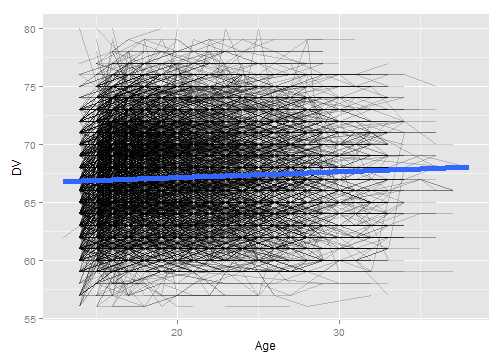
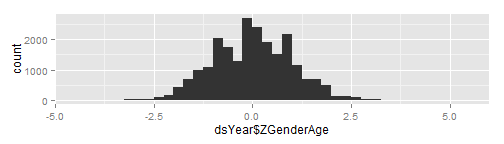
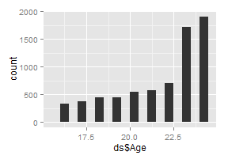

# Calculating Gen2 Height
This sequence picks a single height value per Gen2 subject.


## Define the age cutoffs to keep ages within the same Window as Gen1 Heights.  Define the height cutoffs to exclude values that are more likely to be entry errors or a developmental disorder, than a true reflection of additive genetics

```r
pathInputKellyOutcomes <-  "./OutsideData/KellyHeightWeightMath2012-03-09/ExtraOutcomes79FromKelly2012March.csv"
pathOutputSubjectHeight <- "./ForDistribution/Outcomes/Gen2Height/Gen2Height.csv"

inchesTotalMin <- 56 #4'8"
inchesTotalMax <- 80 #7'0"
feetOnlyMin <- 4
feetOnlyMax <- 8
inchesOnlyMin <- 0
inchesOnlyMax <- 11
ageMin <- 16
ageMax <- 24
zMin <- -3
zMax <- -zMin 


####################################################################################
```


## Load the appropriate information from the SQL Server database

```r
#Equivalent ages for 1981 Heights are 16-24 (ignoring two 15-year-old and 1 26-year-old)
# SELECT count([AgeSelfReportYears]), FLOOR([AgeCalculateYears]) AS Age
# FROM [NlsLinks].[Process].[tblSurveyTime]
# WHERE SurveyYear=1981
# GROUP BY floor([AgeCalculateYears]) ORDER BY Age

channel <- RODBC::odbcDriverConnect("driver={SQL Server}; Server=Bee\\Bass; Database=NlsLinks; Uid=NlsyReadWrite; Pwd=nophi")
dsLong <- sqlQuery(channel, 
                   "SELECT * 
                    FROM [NlsLinks].[Process].[vewOutcome]
                    WHERE Generation=2 AND ItemLabel in ('Gen2HeightFeetOnly', 'Gen2HeightInchesRemainder') 
                    ORDER BY SubjectTag, SurveyYear" 
                   , stringsAsFactors=FALSE
)
dsSubject <- sqlQuery(channel, 
                    "SELECT SubjectTag 
                    FROM [NlsLinks].[Process].[tblSubject]
                    WHERE Generation=2 
                    ORDER BY SubjectTag" 
                    , stringsAsFactors=FALSE
)
odbcClose(channel)
summary(dsLong)
```

```
   SubjectTag        SurveyYear        Item      ItemLabel        
 Min.   :    301   Min.   :1994   Min.   :501   Length:70614      
 1st Qu.: 267702   1st Qu.:2002   1st Qu.:501   Class :character  
 Median : 546901   Median :2006   Median :502   Mode  :character  
 Mean   : 550041   Mean   :2004   Mean   :502                     
 3rd Qu.: 805901   3rd Qu.:2008   3rd Qu.:502                     
 Max.   :1266703   Max.   :2010   Max.   :502                     
     Value         LoopIndex   Generation  SurveyDate        AgeSelfReportYears
 Min.   :-2.00   Min.   :0   Min.   :2    Length:70614       Mode:logical      
 1st Qu.: 5.00   1st Qu.:0   1st Qu.:2    Class :character   NA's:70614        
 Median : 5.00   Median :0   Median :2    Mode  :character                     
 Mean   : 5.23   Mean   :0   Mean   :2                                         
 3rd Qu.: 6.00   3rd Qu.:0   3rd Qu.:2                                         
 Max.   :11.00   Max.   :0   Max.   :2                                         
 AgeCalculateYears     Gender   
 Min.   :13.7      Min.   :1.0  
 1st Qu.:17.2      1st Qu.:1.0  
 Median :20.3      Median :2.0  
 Mean   :21.0      Mean   :1.5  
 3rd Qu.:24.2      3rd Qu.:2.0  
 Max.   :38.0      Max.   :2.0  
```

```r
summary(dsSubject)
```

```
   SubjectTag     
 Min.   :    201  
 1st Qu.: 310402  
 Median : 604606  
 Mean   : 601232  
 3rd Qu.: 876228  
 Max.   :1267501  
```

```r


####################################################################################
```


## Make necessary Adjustments

```r
dsLong$Age <- floor(ifelse(!is.na(dsLong$AgeCalculateYears), dsLong$AgeCalculateYears, dsLong$AgeSelfReportYears)) #This could still be null.
dsLong$AgeCalculateYears <- NULL
dsLong$AgeSelfReportYears <- NULL

testit::assert("All outcomes should have a loop index of zero", all(dsLong$LoopIndex==0))
dsLong$LoopIndex <- NULL

####################################################################################
```


## Combine the feet and inches to get total inches.  

```r
CombineHeightUnits <- function( df ) {
  feet <- df[df$ItemLabel=='Gen2HeightFeetOnly', 'Value']
  feet <- ifelse(feetOnlyMin <= feet & feet <= feetOnlyMax, feet, NA)  
  inches <- df[df$ItemLabel=='Gen2HeightInchesRemainder', 'Value']
  inches <- ifelse(inchesOnlyMin <= inches & inches <= inchesOnlyMax, inches, NA)
  return( data.frame(InchesTotal=feet*12 + inches) )
} 
#Combine to one row per SubjectYear combination
system.time( 
  dsYearStatic <- ddply(dsLong, c("SubjectTag", "SurveyYear", "Age", "Gender"), CombineHeightUnits)
)#17.34; 23.94 sec
```

```
   user  system elapsed 
  18.25    2.19   20.45 
```

```r

dsYear <- dsYearStatic
nrow(dsYear)
```

```
[1] 35307
```

```r
rm(dsLong)

####################################################################################
```


## Show the height data with age of the subject when the height was taken.  Filter out records where the age or the height is outside of the desired window.

```r
#Filter out records with undesired height values
qplot(dsYear$InchesTotal, binwidth=1, main="Before Filtering Out Extreme Heights") #Make sure ages are normalish with no extreme values.
```

 

```r
dsYear <- dsYear[!is.na(dsYear$InchesTotal), ]
dsYear <- dsYear[inchesTotalMin <= dsYear$InchesTotal & dsYear$InchesTotal <= inchesTotalMax, ]
nrow(dsYear)
```

```
[1] 35067
```

```r
summary(dsYear)
```

```
   SubjectTag        SurveyYear        Age           Gender     InchesTotal  
 Min.   :    301   Min.   :1994   Min.   :13.0   Min.   :1.0   Min.   :56.0  
 1st Qu.: 267502   1st Qu.:2002   1st Qu.:17.0   1st Qu.:1.0   1st Qu.:64.0  
 Median : 546701   Median :2006   Median :20.0   Median :2.0   Median :67.0  
 Mean   : 549932   Mean   :2004   Mean   :20.5   Mean   :1.5   Mean   :67.2  
 3rd Qu.: 805901   3rd Qu.:2008   3rd Qu.:24.0   3rd Qu.:2.0   3rd Qu.:70.0  
 Max.   :1266703   Max.   :2010   Max.   :38.0   Max.   :2.0   Max.   :80.0  
```

```r
qplot(dsYear$InchesTotal, binwidth=1, main="After Filtering Out Extreme Heights") #Make sure ages are normalish with no extreme values.
```

 

```r

#Filter out records with undesired age values
ggplot(dsYear, aes(x=Age, y=InchesTotal, group=SubjectTag)) + geom_line(alpha=.2) + geom_smooth(method="rlm", aes(group=NA), size=2)
```

 

```r
dsYear <- dsYear[!is.na(dsYear$Age), ]
dsYear <- dsYear[ageMin <= dsYear$Age & dsYear$Age <= ageMax, ]
nrow(dsYear)
```

```
[1] 22795
```

```r
ggplot(dsYear, aes(x=Age, y=InchesTotal, group=SubjectTag)) + geom_line(alpha=.2) + geom_smooth(method="rlm", aes(group=NA), size=2)
```

 

```r

####################################################################################
```

## Standardize by Gender & Age.  Calculated Age (using SurveyDate and MOB) has been truncated to integers.  

```r
dsYear <- ddply(dsYear, c("Gender"), transform, HeightZGender=scale(InchesTotal))
dsYear <- ddply(dsYear, c("Gender", "Age"), transform, HeightZGenderAge=scale(InchesTotal))
nrow(dsYear)
```

```
[1] 22795
```

```r
qplot(dsYear$HeightZGenderAge, binwidth=.25) #Make sure ages are normalish with no extreme values.
```

 

```r

####################################################################################
```


## Determine Z-score to clip at.  Adjust as necessary (zMin & zMax were defined at the top of the page).  The white box extends between zMin and zMax.

```r
ggplot(dsYear, aes(x=Age, y=HeightZGenderAge, group=SubjectTag)) + 
  annotate("rect", xmin=min(dsYear$Age), xmax=max(dsYear$Age), ymin=zMin, ymax= zMax, fill="gray99") +
  geom_line(alpha=.2) + geom_smooth(method="rlm", aes(group=NA), size=2)
```

 

```r
dsYear <- dsYear[zMin <= dsYear$HeightZGenderAge & dsYear$HeightZGenderAge <= zMax, ]
nrow(dsYear)
```

```
[1] 22733
```

```r
ggplot(dsYear, aes(x=Age, y=HeightZGenderAge, group=SubjectTag)) + 
  annotate("rect", xmin=min(dsYear$Age), xmax=max(dsYear$Age), ymin=zMin, ymax= zMax, fill="gray99") +
  geom_line(alpha=.2) + geom_smooth(method="rlm", aes(group=NA), size=2)
```

 

```r

####################################################################################
```


## Pick the subject's oldest record (within that age window).  Then examine the age & Z values

```r
ds <- ddply(dsYear, "SubjectTag", subset, rank(-Age)==1)
nrow(ds) 
```

```
[1] 7069
```

```r
summary(ds)
```

```
   SubjectTag        SurveyYear        Age           Gender      InchesTotal  
 Min.   :    301   Min.   :1994   Min.   :16.0   Min.   :1.00   Min.   :56.0  
 1st Qu.: 266202   1st Qu.:2004   1st Qu.:20.0   1st Qu.:1.00   1st Qu.:64.0  
 Median : 537401   Median :2008   Median :23.0   Median :1.00   Median :67.0  
 Mean   : 545706   Mean   :2007   Mean   :21.5   Mean   :1.49   Mean   :67.5  
 3rd Qu.: 804403   3rd Qu.:2010   3rd Qu.:24.0   3rd Qu.:2.00   3rd Qu.:71.0  
 Max.   :1266703   Max.   :2010   Max.   :24.0   Max.   :2.00   Max.   :79.0  
 HeightZGender    HeightZGenderAge 
 Min.   :-3.290   Min.   :-2.9855  
 1st Qu.:-0.705   1st Qu.:-0.7195  
 Median :-0.059   Median :-0.0730  
 Mean   : 0.016   Mean   :-0.0016  
 3rd Qu.: 0.587   3rd Qu.: 0.5766  
 Max.   : 2.949   Max.   : 2.9905  
```

```r
# SELECT [Mob], [LastSurveyYearCompleted], [AgeAtLastSurvey]
#   FROM [NlsLinks].[dbo].[vewSubjectDetails79]
#   WHERE Generation=2 and AgeAtLastSurvey >=16
#After the 2010 survey, there were 7,201 subjects who were at least 16 at the last survey.
ds <- plyr::join(x=dsSubject, y=ds, by="SubjectTag", type="left", match="first")
nrow(ds) 
```

```
[1] 11504
```

```r

qplot(ds$Age, binwidth=.5) #Make sure ages are within window, and favoring older values
```

 

```r
qplot(ds$HeightZGenderAge, binwidth=.25) #Make sure ages are normalish with no extreme values.
```

 

```r

####################################################################################
```


## Compare with Kelly's height values.  

Make sure they roughly agree. There are a few differences, including (1) the age range is a little shifted, (2) the 2010 survey wasn't available, (3) the cutoff scores were more generous, and (4) the order of standardization & clipping *might* have been different.

```r
#   Compare against Kelly's previous versions of Gen2 Height
dsKelly <- read.csv(pathInputKellyOutcomes, stringsAsFactors=FALSE)
dsKelly <- dsKelly[, c("SubjectTag", "HeightStandarizedFor19to25")]
dsOldVsNew <- join(x=ds, y=dsKelly, by="SubjectTag", type="full")
nrow(dsOldVsNew)
```

```
[1] 11506
```

```r

#See if the new version is missing a lot of values that the old version caught.
#   The denominator isn't exactly right, because it doesn't account for the 2010 values missing in the new version.
table(is.na(dsOldVsNew$HeightZGenderAge), is.na(dsOldVsNew$HeightStandarizedFor19to25), dnn=c("NewIsMissing", "OldIsMissing"))
```

```
            OldIsMissing
NewIsMissing FALSE TRUE
       FALSE  5089 1980
       TRUE     34 4403
```

```r
#View the correlation
cor(dsOldVsNew$HeightZGenderAge,dsOldVsNew$HeightStandarizedFor19to25, use="complete.obs")
```

```
[1] 0.9553
```

```r
#Compare against an x=y identity line.
ggplot(dsOldVsNew, aes(x=HeightStandarizedFor19to25, y=HeightZGenderAge)) + geom_point(shape=1) + geom_abline() + geom_smooth(method="loess")
```

```
Warning: Removed 6417 rows containing missing values (stat_smooth).
Warning: Removed 6417 rows containing missing values (geom_point).
```

 

```r

####################################################################################
```


## Write the OutcomeData to CSV

```r
write.csv(ds, pathOutputSubjectHeight, row.names=FALSE)
```

