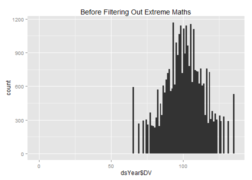
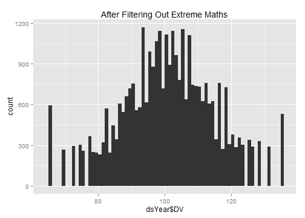
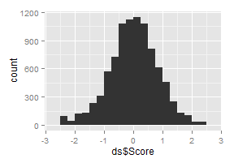
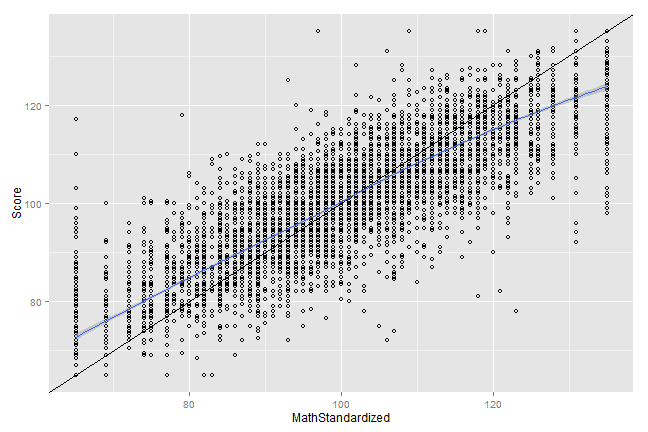

# Calculating Gen2 Math
This sequence picks a single Math value per Gen2 subject.


## Define the age cutoffs to keep ages within the same Window as Gen1 Maths.  Define the Math cutoffs to exclude values that are more likely to be entry errors or a developmental disorder, than a true reflection of additive genetics

```r
pathInputKellyOutcomes <-  "./OutsideData/KellyHeightWeightMath2012-03-09/ExtraOutcomes79FromKelly2012March.csv"
pathOutput <- "./ForDistribution/Outcomes/Gen2Math/Gen2Math.csv"

# dvName <- "Gen2PiatMathRaw"
# dvName <- "Gen2PiatMathPercentile"
dvName <- "Gen2PiatMathStandard"

rawMin <- 0
rawMax <- 84
percentileMin <- 0
percentileMax <- 99
standardMin <- 65
standardMax <- 135

if(dvName=='Gen2PiatMathRaw') {
  DVMin <- rawMin
  DVMax <- rawMax
}
if(dvName=='Gen2PiatMathPercentile') {
  DVMin <- percentileMin
  DVMax <- percentileMax
}
if(dvName=='Gen2PiatMathStandard') {
  DVMin <- standardMin
  DVMax <- standardMax
}

ageMin <- 5
ageMax <- 15
zMin <- -3
zMax <- -zMin 

extractVariablesString <- paste0("'", dvName, "'")
#extractVariablesString <- "'Gen2PiatMathRaw', 'Gen2PiatMathPercentile', 'Gen2PiatMathStandard'"

####################################################################################
```


## Load the appropriate information from the SQL Server database

```r
channel <- RODBC::odbcDriverConnect("driver={SQL Server}; Server=Bee\\Bass; Database=NlsLinks; Uid=NlsyReadWrite; Pwd=nophi")
dsLong <- sqlQuery(channel,  paste0(
  "SELECT * 
  FROM [NlsLinks].[Process].[vewOutcome]
  WHERE Generation=2 AND ItemLabel in (", extractVariablesString, ") 
  ORDER BY SubjectTag, SurveyYear" 
  ), stringsAsFactors=FALSE
)
dsSubject <- sqlQuery(channel, 
  "SELECT SubjectTag 
  FROM [NlsLinks].[Process].[tblSubject]
  WHERE Generation=2 
  ORDER BY SubjectTag" 
  , stringsAsFactors=FALSE
)
dsVariable <- sqlQuery(channel, paste0(
  "SELECT * 
  FROM [NlsLinks].[dbo].[vewVariable]
  WHERE (Translate = 1) AND ItemLabel in (", extractVariablesString, ") 
  ORDER BY Item, SurveyYear, VariableCode"                      
  ), stringsAsFactors=FALSE
)
odbcClose(channel)
summary(dsLong)
```

```
   SubjectTag        SurveyYear        Item      ItemLabel             Value       LoopIndex   Generation  SurveyDate       
 Min.   :    201   Min.   :1986   Min.   :513   Length:33815       Min.   :  0   Min.   :0   Min.   :2    Length:33815      
 1st Qu.: 265501   1st Qu.:1992   1st Qu.:513   Class :character   1st Qu.: 91   1st Qu.:0   1st Qu.:2    Class :character  
 Median : 529501   Median :1996   Median :513   Mode  :character   Median :101   Median :0   Median :2    Mode  :character  
 Mean   : 542962   Mean   :1996   Mean   :513                      Mean   :101   Mean   :0   Mean   :2                      
 3rd Qu.: 800603   3rd Qu.:2000   3rd Qu.:513                      3rd Qu.:110   3rd Qu.:0   3rd Qu.:2                      
 Max.   :1266703   Max.   :2010   Max.   :513                      Max.   :135   Max.   :0   Max.   :2                      
                                                                                                                            
 AgeSelfReportYears AgeCalculateYears     Gender   
 Min.   : 4.9       Min.   : 4.5      Min.   :1.0  
 1st Qu.: 7.2       1st Qu.: 7.3      1st Qu.:1.0  
 Median : 9.6       Median : 9.6      Median :1.0  
 Mean   : 9.7       Mean   : 9.7      Mean   :1.5  
 3rd Qu.:12.0       3rd Qu.:12.0      3rd Qu.:2.0  
 Max.   :18.1       Max.   :18.1      Max.   :2.0  
 NA's   :1098       NA's   :1098                   
```

```r
nrow(dsSubject)
```

```
[1] 11504
```

```r

####################################################################################
```


## Make necessary Adjustments

```r
dsLong$Age <- floor(ifelse(!is.na(dsLong$AgeCalculateYears), dsLong$AgeCalculateYears, dsLong$AgeSelfReportYears)) #This could still be null.
dsLong$AgeCalculateYears <- NULL
dsLong$AgeSelfReportYears <- NULL

testit::assert("All outcomes should have a loop index of zero", all(dsLong$LoopIndex==0))
dsLong$LoopIndex <- NULL

# #There is at least one bad value, so I'm stripping them out before they get to the averaging (Subject 859801 has a '0' for the Standard, which should have a min of '65')
# dsLong[(dsLong$ItemLabel=='Gen2PiatMathRaw') & (dsLong$Value > rawMax), 'Value'] <- NA_integer_
# dsLong[(dsLong$ItemLabel=='Gen2PiatMathRaw') & (dsLong$Value < rawMin), 'Value'] <- NA_integer_
# dsLong[(dsLong$ItemLabel=='Gen2PiatMathPercentile') & (dsLong$Value > percentileMax), 'Value'] <- NA_integer_
# dsLong[(dsLong$ItemLabel=='Gen2PiatMathPercentile') & (dsLong$Value < percentileMin), 'Value'] <- NA_integer_
# dsLong[(dsLong$ItemLabel=='Gen2PiatMathStandard') & (dsLong$Value > standardMax), 'Value'] <- NA_integer_
# dsLong[(dsLong$ItemLabel=='Gen2PiatMathStandard') & (dsLong$Value < standardMin), 'Value'] <- NA_integer_

####################################################################################
```


## Combine the feet and inches to get total inches.  

```r
# CombineScores <- function( df ) {
#   rawScores <- df[df$ItemLabel=='Gen2PiatMathRaw', 'Value']
#   percentileScores <- df[df$ItemLabel=='Gen2PiatMathPercentile', 'Value']
#   standardScores <- df[df$ItemLabel=='Gen2PiatMathStandard', 'Value']
#   
#   data.frame(
#     Raw=mean(rawScores, na.rm=T),
#     Percentile=mean(percentileScores, na.rm=T),
#     Standard=mean(standardScores, na.rm=T)
#   )
# }

#Combine to one row per SubjectYear combination
# system.time( 
#   dsYearStatic <- ddply(dsLong, c("SubjectTag", "SurveyYear", "Age", "Gender"), nrow)
# )# sec
# table(dsYearStatic$V1)
dsYearStatic <- dsLong[, c("SubjectTag", "SurveyYear", "Age", "Gender", "Value")]
dsYearStatic <- plyr::rename(dsYearStatic, replace=c("Value"="DV"))

dsYear <- dsYearStatic
nrow(dsYear)
```

```
[1] 33815
```

```r
rm(dsLong)

####################################################################################
```


## Show the Math data with age of the subject when the Math was taken.  Filter out records where the age or the Math is outside of the desired window.

```r
#Filter out records with undesired Math values
qplot(dsYear$DV, binwidth=1, main="Before Filtering Out Extreme Maths")
```

 

```r
dsYear <- dsYear[!is.na(dsYear$DV), ]
dsYear <- dsYear[DVMin <= dsYear$DV & dsYear$DV <= DVMax, ]
nrow(dsYear)
```

```
[1] 33814
```

```r
summary(dsYear)
```

```
   SubjectTag        SurveyYear        Age           Gender          DV     
 Min.   :    201   Min.   :1986   Min.   : 4.0   Min.   :1.0   Min.   : 65  
 1st Qu.: 265501   1st Qu.:1992   1st Qu.: 7.0   1st Qu.:1.0   1st Qu.: 91  
 Median : 529501   Median :1996   Median : 9.0   Median :1.0   Median :101  
 Mean   : 542953   Mean   :1996   Mean   : 9.2   Mean   :1.5   Mean   :101  
 3rd Qu.: 800603   3rd Qu.:2000   3rd Qu.:12.0   3rd Qu.:2.0   3rd Qu.:110  
 Max.   :1266703   Max.   :2010   Max.   :18.0   Max.   :2.0   Max.   :135  
                                  NA's   :1097                              
```

```r
qplot(dsYear$DV, binwidth=1, main="After Filtering Out Extreme Maths") 
```

 

```r

#Filter out records with undesired age values
qplot(dsYear$Age, binwidth=1, main="Before Filtering Out Extreme Ages") 
```

 

```r
ggplot(dsYear, aes(x=Age, y=DV, group=SubjectTag)) + geom_line(alpha=.2) + geom_smooth(method="rlm", aes(group=NA), size=2)
```

```
Warning: Removed 1097 rows containing missing values (stat_smooth).
Warning: Removed 1014 rows containing missing values (geom_path).
```

 

```r
dsYear <- dsYear[!is.na(dsYear$Age), ]
dsYear <- dsYear[ageMin <= dsYear$Age & dsYear$Age <= ageMax, ]
nrow(dsYear)
```

```
[1] 32375
```

```r
qplot(dsYear$Age, binwidth=1, main="After Filtering Out Extreme Ages") 
```

 

```r
ggplot(dsYear, aes(x=Age, y=DV, group=SubjectTag)) + geom_line(alpha=.2) + geom_smooth(method="rlm", aes(group=NA), size=2)
```

 

```r

####################################################################################
```


## Standardize by Gender & Age.  Calculated Age (using SurveyDate and MOB) has been truncated to integers.  

```r
# dsYear <- ddply(dsYear, c("Gender"), transform, ZGender=scale(DV))
dsYear <- ddply(dsYear, c("Gender", "Age"), transform, ZGenderAge=scale(DV))
nrow(dsYear)
```

```
[1] 32375
```

```r
qplot(dsYear$ZGenderAge, binwidth=.25)
```

 

```r

####################################################################################
```


## Determine Z-score to clip at.  Adjust as necessary (zMin & zMax were defined at the top of the page).  The white box extends between zMin and zMax.

```r
ggplot(dsYear, aes(x=Age, y=ZGenderAge, group=SubjectTag)) + 
  annotate("rect", xmin=min(dsYear$Age), xmax=max(dsYear$Age), ymin=zMin, ymax= zMax, fill="gray99") +
  geom_line(alpha=.2) + geom_smooth(method="rlm", aes(group=NA), size=2)
```

 

```r
dsYear <- dsYear[zMin <= dsYear$ZGenderAge & dsYear$ZGenderAge <= zMax, ]
nrow(dsYear)
```

```
[1] 32345
```

```r
ggplot(dsYear, aes(x=Age, y=ZGenderAge, group=SubjectTag)) + 
  annotate("rect", xmin=min(dsYear$Age), xmax=max(dsYear$Age), ymin=zMin, ymax= zMax, fill="gray99") +
  geom_line(alpha=.2) + geom_smooth(method="rlm", aes(group=NA), size=2)
```

 

```r

####################################################################################
```


## Pick the subject's oldest record (within that age window).  Then examine the age & Z values

```r
#ds <- ddply(dsYear, "SubjectTag", subset, rank(-Age, ties.method="first")==1)
ds <- ddply(dsYear, "SubjectTag", summarize, ZGenderAge=median(ZGenderAge))
nrow(ds) 
```

```
[1] 9105
```

```r
summary(ds)
```

```
   SubjectTag        ZGenderAge     
 Min.   :    201   Min.   :-2.6837  
 1st Qu.: 276902   1st Qu.:-0.5766  
 Median : 553702   Median :-0.0045  
 Mean   : 560749   Mean   :-0.0225  
 3rd Qu.: 826505   3rd Qu.: 0.5691  
 Max.   :1266703   Max.   : 2.8289  
```

```r
# SELECT [Mob], [LastSurveyYearCompleted], [AgeAtLastSurvey]
#   FROM [NlsLinks].[dbo].[vewSubjectDetails79]
#   WHERE Generation=2 and AgeAtLastSurvey >=16
#After the 2010 survey, there were 7,201 subjects who were at least 16 at the last survey.
ds <- plyr::join(x=dsSubject, y=ds, by="SubjectTag", type="left", match="first")
nrow(ds) 
```

```
[1] 11504
```

```r

# qplot(ds$Age, binwidth=.5) #Make sure ages are within window, and favoring older values
qplot(ds$ZGenderAge, binwidth=.25) #Make sure ages are normalish with no extreme values.
```

 

```r
table(is.na(ds$ZGenderAge))
```

```

FALSE  TRUE 
 9105  2399 
```

```r

####################################################################################
```


## Compare with Kelly's Math values.  
Make sure they roughly agree. There are a few differences, including (1) the age range is a little shifted, (2) the 2010 survey wasn't available, (3) the cutoff scores were more generous, and (4) the order of standardization & clipping *might* have been different.

```r
#   Compare against Kelly's previous versions of Gen2 Math
dsKelly <- read.csv(pathInputKellyOutcomes, stringsAsFactors=FALSE)
dsKelly <- dsKelly[, c("SubjectTag", "MathStandardized")]
dsOldVsNew <- join(x=ds, y=dsKelly, by="SubjectTag", type="full")
nrow(dsOldVsNew)
```

```
[1] 11506
```

```r

#See if the new version is missing a lot of values that the old version caught.
#   The denominator isn't exactly right, because it doesn't account for the 2010 values missing in the new version.
table(is.na(dsOldVsNew$MathStandardized), is.na(dsOldVsNew$ZGenderAge), dnn=c("OldIsMissing", "NewIsMissing"))
```

```
            NewIsMissing
OldIsMissing FALSE TRUE
       FALSE  9105   37
       TRUE      0 2364
```

```r
#View the correlation
cor(dsOldVsNew$MathStandardized, dsOldVsNew$ZGenderAge, use="complete.obs")
```

```
[1] 0.866
```

```r
#Compare against an x=y identity line.
ggplot(dsOldVsNew, aes(x=MathStandardized, y=ZGenderAge)) + geom_point(shape=1) + geom_abline() + geom_smooth(method="loess")
```

```
Warning: Removed 2401 rows containing missing values (stat_smooth).
Warning: Removed 2401 rows containing missing values (geom_point).
```

 

```r

####################################################################################
```


## Write the OutcomeData to CSV

```r
write.csv(ds, pathOutput, row.names=FALSE)

####################################################################################
```


## NLSY Variables
Each row in the table represents and NLSY variable that was used.  The first column is the official "R Number" designated by the NLSY.  The remaining columns are values we assigned to help the plumbing and data manipulation.

```r
dsVariable[, c("VariableCode", "SurveyYear", "Item", "ItemLabel", "Generation", "ExtractSource", "ID")]
```

```
   VariableCode SurveyYear Item            ItemLabel Generation ExtractSource   ID
1      C0580100       1986  513 Gen2PiatMathStandard          2            13 2197
2      C0799600       1988  513 Gen2PiatMathStandard          2            13 2200
3      C0998800       1990  513 Gen2PiatMathStandard          2            13 2203
4      C1198800       1992  513 Gen2PiatMathStandard          2            13 2206
5      C1507800       1994  513 Gen2PiatMathStandard          2            13 2209
6      C1564700       1996  513 Gen2PiatMathStandard          2            13 2212
7      C1800100       1998  513 Gen2PiatMathStandard          2            13 2215
8      C2503700       2000  513 Gen2PiatMathStandard          2            13 2218
9      C2532200       2002  513 Gen2PiatMathStandard          2            13 2221
10     C2803000       2004  513 Gen2PiatMathStandard          2            13 2224
11     C3111500       2006  513 Gen2PiatMathStandard          2            13 2227
12     C3615200       2008  513 Gen2PiatMathStandard          2            13 2230
13     C3993800       2010  513 Gen2PiatMathStandard          2            13 2233
```

