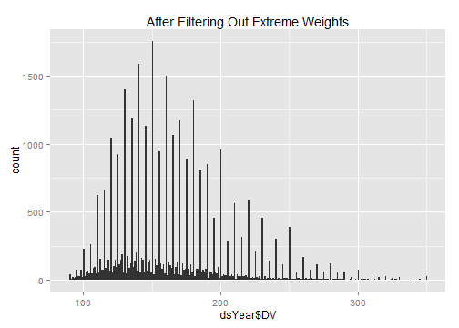

# Calculating Gen2 Weight
This sequence picks a single Weight value per Gen2 subject.


## Define the age cutoffs to keep ages within the same Window as Gen1 Weights.  Define the Weight cutoffs to exclude values that are more likely to be entry errors or a developmental disorder, than a true reflection of additive genetics

```r
pathInputKellyOutcomes <-  "./OutsideData/KellyHeightWeightMath2012-03-09/ExtraOutcomes79FromKelly2012March.csv"
pathOutput <- "./ForDistribution/Outcomes/Gen2Weight/Gen2Weight.csv"

DVMin <- 90 
DVMax <- 350 

ageMin <- 16
ageMax <- 24
zMin <- -3
zMax <- 5

extractVariablesString <- "'Gen2WeightPoundsYA'"

####################################################################################
```


## Load the appropriate information from the SQL Server database

```r
channel <- RODBC::odbcDriverConnect("driver={SQL Server}; Server=Bee\\Bass; Database=NlsLinks; Uid=NlsyReadWrite; Pwd=nophi")
dsLong <- sqlQuery(channel,  paste0(
  "SELECT * 
  FROM [NlsLinks].[Process].[vewOutcome]
  WHERE Generation=2 AND ItemLabel in (", extractVariablesString, ") 
  ORDER BY SubjectTag, SurveyYear" 
  ), stringsAsFactors=FALSE
)
dsSubject <- sqlQuery(channel, 
  "SELECT SubjectTag 
  FROM [NlsLinks].[Process].[tblSubject]
  WHERE Generation=2 
  ORDER BY SubjectTag" 
  , stringsAsFactors=FALSE
)
dsVariable <- sqlQuery(channel, paste0(
  "SELECT * 
  FROM [NlsLinks].[dbo].[vewVariable]
  WHERE (Translate = 1) AND ItemLabel in (", extractVariablesString, ") 
  ORDER BY Item, SurveyYear, VariableCode"                      
  ), stringsAsFactors=FALSE
)
odbcClose(channel)
summary(dsLong)
```

```
   SubjectTag        SurveyYear        Item      ItemLabel             Value       LoopIndex   Generation  SurveyDate       
 Min.   :    301   Min.   :1994   Min.   :504   Length:33167       Min.   : 70   Min.   :0   Min.   :2    Length:33167      
 1st Qu.: 266952   1st Qu.:2002   1st Qu.:504   Class :character   1st Qu.:135   1st Qu.:0   1st Qu.:2    Class :character  
 Median : 543602   Median :2006   Median :504   Mode  :character   Median :158   Median :0   Median :2    Mode  :character  
 Mean   : 548188   Mean   :2005   Mean   :504                      Mean   :165   Mean   :0   Mean   :2                      
 3rd Qu.: 804401   3rd Qu.:2008   3rd Qu.:504                      3rd Qu.:185   3rd Qu.:0   3rd Qu.:2                      
 Max.   :1266703   Max.   :2010   Max.   :504                      Max.   :766   Max.   :0   Max.   :2                      
 AgeSelfReportYears AgeCalculateYears     Gender   
 Mode:logical       Min.   :14.0      Min.   :1.0  
 NA's:33167         1st Qu.:17.4      1st Qu.:1.0  
                    Median :20.6      Median :2.0  
                    Mean   :21.2      Mean   :1.5  
                    3rd Qu.:24.5      3rd Qu.:2.0  
                    Max.   :38.0      Max.   :2.0  
```

```r
nrow(dsSubject)
```

```
[1] 11504
```

```r

####################################################################################
```


## Make necessary Adjustments

```r
dsLong$Age <- floor(ifelse(!is.na(dsLong$AgeCalculateYears), dsLong$AgeCalculateYears, dsLong$AgeSelfReportYears)) #This could still be null.
dsLong$AgeCalculateYears <- NULL
dsLong$AgeSelfReportYears <- NULL

testit::assert("All outcomes should have a loop index of zero", all(dsLong$LoopIndex==0))
dsLong$LoopIndex <- NULL

####################################################################################
```


## Combine the feet and inches to get total inches.  

```r
dsYear <- dsLong[, c("SubjectTag", "SurveyYear", "Age", "Gender", "Value")]
dsYear <- plyr::rename(dsYear, replace=c("Value"="DV"))
nrow(dsYear)
```

```
[1] 33167
```

```r
rm(dsLong)

####################################################################################
```


## Show the Weight data with age of the subject when the Weight was taken.  Filter out records where the age or the Weight is outside of the desired window.

```r
#Filter out records with undesired Weight values
qplot(dsYear$DV, binwidth=1, main="Before Filtering Out Extreme Weights")
```

 

```r
dsYear <- dsYear[!is.na(dsYear$DV), ]
dsYear <- dsYear[DVMin <= dsYear$DV & dsYear$DV <= DVMax, ]
nrow(dsYear)
```

```
[1] 33033
```

```r
summary(dsYear)
```

```
   SubjectTag        SurveyYear        Age           Gender          DV     
 Min.   :    301   Min.   :1994   Min.   :14.0   Min.   :1.0   Min.   : 90  
 1st Qu.: 266901   1st Qu.:2002   1st Qu.:17.0   1st Qu.:1.0   1st Qu.:135  
 Median : 543402   Median :2006   Median :20.0   Median :2.0   Median :158  
 Mean   : 548024   Mean   :2005   Mean   :20.7   Mean   :1.5   Mean   :164  
 3rd Qu.: 803901   3rd Qu.:2008   3rd Qu.:24.0   3rd Qu.:2.0   3rd Qu.:185  
 Max.   :1266703   Max.   :2010   Max.   :38.0   Max.   :2.0   Max.   :350  
```

```r
qplot(dsYear$DV, binwidth=1, main="After Filtering Out Extreme Weights") 
```

 

```r

#Filter out records with undesired age values
qplot(dsYear$Age, binwidth=1, main="Before Filtering Out Extreme Ages") 
```

 

```r
ggplot(dsYear, aes(x=Age, y=DV, group=SubjectTag)) + geom_line(alpha=.2) + geom_smooth(method="rlm", aes(group=NA), size=2)
```

 

```r
dsYear <- dsYear[!is.na(dsYear$Age), ]
dsYear <- dsYear[ageMin <= dsYear$Age & dsYear$Age <= ageMax, ]
nrow(dsYear)
```

```
[1] 21501
```

```r
qplot(dsYear$Age, binwidth=1, main="After Filtering Out Extreme Ages") 
```

 

```r
ggplot(dsYear, aes(x=Age, y=DV, group=SubjectTag)) + geom_line(alpha=.2) + geom_smooth(method="rlm", aes(group=NA), size=2)
```

 

```r

####################################################################################
```


## Standardize by Gender & Age.  Calculated Age (using SurveyDate and MOB) has been truncated to integers.  

```r
# dsYear <- ddply(dsYear, c("Gender"), transform, ZGender=scale(DV))
dsYear <- ddply(dsYear, c("Gender", "Age"), transform, ZGenderAge=scale(DV))
nrow(dsYear)
```

```
[1] 21501
```

```r
qplot(dsYear$ZGenderAge, binwidth=.25)
```

 

```r

####################################################################################
```


## Determine Z-score to clip at.  Adjust as necessary (zMin & zMax were defined at the top of the page).  The white box extends between zMin and zMax.

```r
ggplot(dsYear, aes(x=Age, y=ZGenderAge, group=SubjectTag)) + 
  annotate("rect", xmin=min(dsYear$Age), xmax=max(dsYear$Age), ymin=zMin, ymax= zMax, fill="gray99") +
  geom_line(alpha=.2) + geom_smooth(method="rlm", aes(group=NA), size=2)
```

 

```r
dsYear <- dsYear[zMin <= dsYear$ZGenderAge & dsYear$ZGenderAge <= zMax, ]
nrow(dsYear)
```

```
[1] 21495
```

```r
ggplot(dsYear, aes(x=Age, y=ZGenderAge, group=SubjectTag)) + 
  annotate("rect", xmin=min(dsYear$Age), xmax=max(dsYear$Age), ymin=zMin, ymax= zMax, fill="gray99") +
  geom_line(alpha=.2) + geom_smooth(method="rlm", aes(group=NA), size=2)
```

 

```r

####################################################################################
```


## Pick the subject's oldest record (within that age window).  Then examine the age & Z values

```r
ds <- ddply(dsYear, "SubjectTag", subset, rank(-Age, ties.method="first")==1)
nrow(ds) 
```

```
[1] 7041
```

```r
summary(ds)
```

```
   SubjectTag        SurveyYear        Age           Gender           DV        ZGenderAge    
 Min.   :    301   Min.   :1994   Min.   :16.0   Min.   :1.00   Min.   : 90   Min.   :-2.336  
 1st Qu.: 266202   1st Qu.:2004   1st Qu.:20.0   1st Qu.:1.00   1st Qu.:140   1st Qu.:-0.685  
 Median : 537401   Median :2008   Median :23.0   Median :1.00   Median :160   Median :-0.221  
 Mean   : 545143   Mean   :2007   Mean   :21.5   Mean   :1.49   Mean   :168   Mean   :-0.003  
 3rd Qu.: 803102   3rd Qu.:2010   3rd Qu.:24.0   3rd Qu.:2.00   3rd Qu.:190   3rd Qu.: 0.494  
 Max.   :1266703   Max.   :2010   Max.   :24.0   Max.   :2.00   Max.   :350   Max.   : 4.932  
```

```r
# SELECT [Mob], [LastSurveyYearCompleted], [AgeAtLastSurvey]
#   FROM [NlsLinks].[dbo].[vewSubjectDetails79]
#   WHERE Generation=2 and AgeAtLastSurvey >=16
#After the 2010 survey, there were 7,201 subjects who were at least 16 at the last survey.
ds <- plyr::join(x=dsSubject, y=ds, by="SubjectTag", type="left", match="first")
nrow(ds) 
```

```
[1] 11504
```

```r

qplot(ds$Age, binwidth=.5) #Make sure ages are within window, and favoring older values
```

 

```r
qplot(ds$ZGenderAge, binwidth=.25) #Make sure ages are normalish with no extreme values.
```

 

```r
table(is.na(ds$ZGenderAge))
```

```

FALSE  TRUE 
 7041  4463 
```

```r

####################################################################################
```


## Compare with Kelly's Weight values.  
Make sure they roughly agree. There are a few differences, including (1) the age range is a little shifted, (2) the 2010 survey wasn't available, (3) the cutoff scores were more generous, and (4) the order of standardization & clipping *might* have been different.

```r
#   Compare against Kelly's previous versions of Gen2 Weight
dsKelly <- read.csv(pathInputKellyOutcomes, stringsAsFactors=FALSE)
dsKelly <- dsKelly[, c("SubjectTag", "WeightStandardizedForAge19To25")]
dsOldVsNew <- join(x=ds, y=dsKelly, by="SubjectTag", type="full")
nrow(dsOldVsNew)
```

```
[1] 11506
```

```r

#See if the new version is missing a lot of values that the old version caught.
#   The denominator isn't exactly right, because it doesn't account for the 2010 values missing in the new version.
table(is.na(dsOldVsNew$WeightStandardizedForAge19To25), is.na(dsOldVsNew$ZGenderAge), dnn=c("OldIsMissing", "NewIsMissing"))
```

```
            NewIsMissing
OldIsMissing FALSE TRUE
       FALSE  5073   42
       TRUE   1968 4423
```

```r
#View the correlation
cor(dsOldVsNew$WeightStandardizedForAge19To25, dsOldVsNew$ZGenderAge, use="complete.obs")
```

```
[1] 0.9274
```

```r
#Compare against an x=y identity line.
ggplot(dsOldVsNew, aes(x=WeightStandardizedForAge19To25, y=ZGenderAge)) + geom_point(shape=1) + geom_abline() + geom_smooth(method="loess")
```

```
Warning: Removed 6433 rows containing missing values (stat_smooth).
Warning: Removed 6433 rows containing missing values (geom_point).
```

 

```r

####################################################################################
```


## Write the OutcomeData to CSV

```r
write.csv(ds, pathOutput, row.names=FALSE)

####################################################################################
```


## NLSY Variables
Each row in the table represents and NLSY variable that was used.  The first column is the official "R Number" designated by the NLSY.  The remaining columns are values we assigned to help the plumbing and data manipulation.

```r
dsVariable[, c("VariableCode", "SurveyYear", "Item", "ItemLabel", "Generation", "ExtractSource", "ID")]
```

```
  VariableCode SurveyYear Item          ItemLabel Generation ExtractSource   ID
1     Y0308500       1994  504 Gen2WeightPoundsYA          2            12 2187
2     Y0904100       1998  504 Gen2WeightPoundsYA          2            12 2188
3     Y1151000       2000  504 Gen2WeightPoundsYA          2            12 2189
4     Y1386000       2002  504 Gen2WeightPoundsYA          2            12 2190
5     Y1637700       2004  504 Gen2WeightPoundsYA          2            12 2191
6     Y1891300       2006  504 Gen2WeightPoundsYA          2            12 2192
7     Y2207200       2008  504 Gen2WeightPoundsYA          2            12 2193
8     Y2544900       2010  504 Gen2WeightPoundsYA          2            12 2194
```

