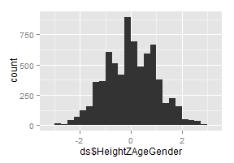
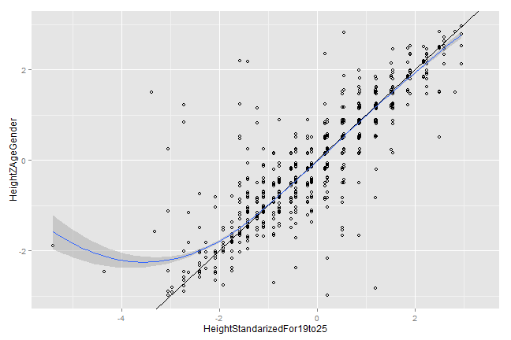

# Calculating Gen2 Height
This sequence picks a single height value per Gen2 subject.


### Define the age cutoffs to keep ages within the same Window as Gen1 Heights.  Define the height cutoffs to exclude values that are more likely to be entry errors or a developmental disorder, than a true reflection of additive genetics

```r
inchesTotalMin <- 56 #4'8"
inchesTotalMax <- 80 #7'0"
feetOnlyMin <- 4
feetOnlyMax <- 8
inchesOnlyMin <- 0
inchesOnlyMax <- 11
ageMin <- 16
ageMax <- 24
zMin <- -3
zMax <- -zMin 
```


### Load the appropriate information from the SQL Server database

```r
#Equivalent ages for 1981 Heights are 16-24 (ignoring two 15-year-old and 1 26-year-old)
# SELECT count([AgeSelfReportYears]), FLOOR([AgeCalculateYears]) AS Age
# FROM [NlsLinks].[Process].[tblSurveyTime]
# WHERE SurveyYear=1981
# GROUP BY floor([AgeCalculateYears]) ORDER BY Age

channel <- odbcConnect("BeeNlsLinks")
dsHeightLong <- sqlQuery(channel, 
  "SELECT SubjectTag, SurveyYear, Item, Value
    FROM NlsLinks.Process.tblResponse
    WHERE Generation=2 AND Item in (501, 502) 
    ORDER BY SubjectTag, SurveyYear" 
)#Items 501 & 502 are HeightInFeetOnly and HeightInInchesOnly
dsSubjectYear <- sqlQuery(channel, 
  "SELECT tblSurveyTime.SubjectTag, tblSurveyTime.SurveyYear, 
  Floor(tblSurveyTime.AgeCalculateYears) AS Age, tblSubject.Generation, tblSubject.Gender
  FROM NlsLinks.Process.tblSurveyTime 
    INNER JOIN NlsLinks.Process.tblSubject ON tblSurveyTime.SubjectTag = tblSubject.SubjectTag
  WHERE Generation=2 AND  (AgeCalculateYears IS NOT NULL)
  ORDER BY SubjectTag, SurveyYear"
)
odbcClose(channel)
summary(dsHeightLong)
```

```
   SubjectTag        SurveyYear        Item         Value      
 Min.   :    301   Min.   :1994   Min.   :501   Min.   :-2.00  
 1st Qu.: 267702   1st Qu.:2002   1st Qu.:501   1st Qu.: 5.00  
 Median : 546901   Median :2006   Median :502   Median : 5.00  
 Mean   : 550041   Mean   :2004   Mean   :502   Mean   : 5.23  
 3rd Qu.: 805901   3rd Qu.:2008   3rd Qu.:502   3rd Qu.: 6.00  
 Max.   :1266703   Max.   :2010   Max.   :502   Max.   :11.00  
```

```r
summary(dsSubjectYear)
```

```
   SubjectTag        SurveyYear        Age         Generation     Gender   
 Min.   :    201   Min.   :1986   Min.   : 0.0   Min.   :2    Min.   :1.0  
 1st Qu.: 266304   1st Qu.:1992   1st Qu.: 6.0   1st Qu.:2    1st Qu.:1.0  
 Median : 533301   Median :1998   Median :12.0   Median :2    Median :1.0  
 Mean   : 546354   Mean   :1999   Mean   :12.6   Mean   :2    Mean   :1.5  
 3rd Qu.: 805101   3rd Qu.:2004   3rd Qu.:18.0   3rd Qu.:2    3rd Qu.:2.0  
 Max.   :1266703   Max.   :2010   Max.   :38.0   Max.   :2    Max.   :2.0  
```

```r
comma(c(nrow(dsHeightLong), nrow(dsSubjectYear)))
```

```
[1] "70,614" "86,579"
```


### Combine the feet and inches to get total inches.  Filter out records with height values that are outside the desired range

```r
CombineHeightUnits <- function( df ) {
  feet <- df[df$Item==501, 'Value']
  feet <- ifelse(feetOnlyMin <= feet & feet <= feetOnlyMax, feet, NA)  
  inches <- df[df$Item==502, 'Value']
  inches <- ifelse(inchesOnlyMin <= inches & inches <= inchesOnlyMax, inches, NA)
  return( data.frame(InchesTotal=feet*12 + inches) )
} # system.time( )#23.94 sec
#Combine to one row per SubjectYear combination
dsHeightYear <- ddply(dsHeightLong, c("SubjectTag", "SurveyYear"), CombineHeightUnits)
nrow(dsHeightYear)
```

```
[1] 35307
```

```r

#Filter out records with undesired height values
dsHeightYear <- dsHeightYear[inchesTotalMin <= dsHeightYear$InchesTotal & dsHeightYear$InchesTotal <= inchesTotalMax, ]
dsHeightYear <- dsHeightYear[!is.na(dsHeightYear$InchesTotal), ]
nrow(dsHeightYear)
```

```
[1] 35067
```

```r
summary(dsHeightYear)
```

```
   SubjectTag        SurveyYear    InchesTotal  
 Min.   :    301   Min.   :1994   Min.   :56.0  
 1st Qu.: 267502   1st Qu.:2002   1st Qu.:64.0  
 Median : 546701   Median :2006   Median :67.0  
 Mean   : 549932   Mean   :2004   Mean   :67.2  
 3rd Qu.: 805901   3rd Qu.:2008   3rd Qu.:70.0  
 Max.   :1266703   Max.   :2010   Max.   :80.0  
```

```r
qplot(dsHeightYear$InchesTotal, binwidth=1) #Make sure ages are normalish with no extreme values.
```

 

```r
rm(dsHeightLong)
```


### Join the height data with age of the subject when the height was taken.  Filter out records where the age is outside of the desired window.

```r
dsLong <- join(x=dsSubjectYear, y=dsHeightYear, type="inner", by=c("SubjectTag", "SurveyYear"))
nrow(dsLong)
```

```
[1] 35067
```

```r
ggplot(dsLong, aes(x=Age, y=InchesTotal, group=SubjectTag)) + geom_line(alpha=.2) + geom_smooth(method="rlm", aes(group=NA), size=2)
```

 

```r
rm(dsSubjectYear, dsHeightYear)
```

### Standardize by Gender & Age.  Calculated Age (using SurveyDate and MOB) has been truncated to integers.  

```r
dsLong <- dsLong[ageMin <= dsLong$Age & dsLong$Age <= ageMax, ]
nrow(dsLong)
```

```
[1] 22795
```

```r
dsLong <- ddply(dsLong, c("Age", "Gender"), transform, HeightZAgeGender=scale(InchesTotal))
nrow(dsLong)
```

```
[1] 22795
```

```r
qplot(dsLong$HeightZAgeGender, binwidth=.25) #Make sure ages are normalish with no extreme values.
```

 


### Determine Z-score to clip at.  Adjust as necessary (zMin & zMax were defined at the top of the page).  The white box extends between zMin and zMax.

```r
ggplot(dsLong, aes(x=Age, y=HeightZAgeGender, group=SubjectTag)) + 
  annotate("rect", xmin=min(dsLong$Age), xmax=max(dsLong$Age), ymin=zMin, ymax= zMax, fill="gray99") +
  geom_line(alpha=.2) + geom_smooth(method="rlm", aes(group=NA), size=2)
```

 

```r
dsLong <- dsLong[zMin <= dsLong$HeightZAgeGender & dsLong$HeightZAgeGender <= zMax, ]
nrow(dsLong)
```

```
[1] 22733
```


### Pick the subject's oldest record (within that age window).  Then examine the age & Z values

```r
ds <- ddply(dsLong, "SubjectTag", subset, rank(-Age)==1)
summary(ds)
```

```
   SubjectTag        SurveyYear        Age         Generation     Gender    
 Min.   :    301   Min.   :1994   Min.   :16.0   Min.   :2    Min.   :1.00  
 1st Qu.: 266202   1st Qu.:2004   1st Qu.:20.0   1st Qu.:2    1st Qu.:1.00  
 Median : 537401   Median :2008   Median :23.0   Median :2    Median :1.00  
 Mean   : 545706   Mean   :2007   Mean   :21.5   Mean   :2    Mean   :1.49  
 3rd Qu.: 804403   3rd Qu.:2010   3rd Qu.:24.0   3rd Qu.:2    3rd Qu.:2.00  
 Max.   :1266703   Max.   :2010   Max.   :24.0   Max.   :2    Max.   :2.00  
  InchesTotal   HeightZAgeGender 
 Min.   :56.0   Min.   :-2.9855  
 1st Qu.:64.0   1st Qu.:-0.7195  
 Median :67.0   Median :-0.0730  
 Mean   :67.5   Mean   :-0.0016  
 3rd Qu.:71.0   3rd Qu.: 0.5766  
 Max.   :79.0   Max.   : 2.9905  
```

```r
# SELECT [Mob], [LastSurveyYearCompleted], [AgeAtLastSurvey]
#   FROM [NlsLinks].[dbo].[vewSubjectDetails79]
#   WHERE Generation=2 and AgeAtLastSurvey >=16
#After the 2010 survey, there were 7,201 subjects who were at least 16 at the last survey.
nrow(ds) 
```

```
[1] 7069
```

```r
qplot(ds$Age, binwidth=.5) #Make sure ages are within window, and favoring older values
```

 

```r
qplot(ds$HeightZAgeGender, binwidth=.25) #Make sure ages are normalish with no extreme values.
```

 


### Compare with Kelly's height values.  Make sure they roughly agree. There are a few differences, including (1) the age range is a little shifted, (2) the 2010 survey wasn't available, (3) the cutoff scores were more generous, and (4) the order of standardization & clipping *might* have been different.

```r
#   Compare against Kelly's previous versions of Gen2 Height
dsKelly <- read.csv(pathInputKellyOutcomes, stringsAsFactors=FALSE)
dsKelly <- dsKelly[, c("SubjectTag", "HeightStandarizedFor19to25")]
dsOldVsNew <- join(x=ds, y=dsKelly, by="SubjectTag", type="full")

#See if the new version is missing a lot of values that the old version caught.
#   The denominator isn't exactly right, because it doesn't account for the 2010 values missing in the new version.
table(is.na(dsOldVsNew$HeightZAgeGender), is.na(dsOldVsNew$HeightStandarizedFor19to25), dnn=c("NewIsMissing", "OldIsMissing"))
```

```
            OldIsMissing
NewIsMissing FALSE TRUE
       FALSE  5089 1980
       TRUE     34 4392
```

```r
#View the correlation
cor(dsOldVsNew$HeightZAgeGender,dsOldVsNew$HeightStandarizedFor19to25, use="complete.obs")
```

```
[1] 0.9553
```

```r
#Compare against an x=y identity line.
ggplot(dsOldVsNew, aes(x=HeightStandarizedFor19to25, y=HeightZAgeGender)) + geom_point(shape=1) + geom_abline() + geom_smooth(method="loess")
```

 

```r

# @knitr WriteToCsv
write.csv(ds, pathOutputSubjectHeight, row.names=FALSE)
```

