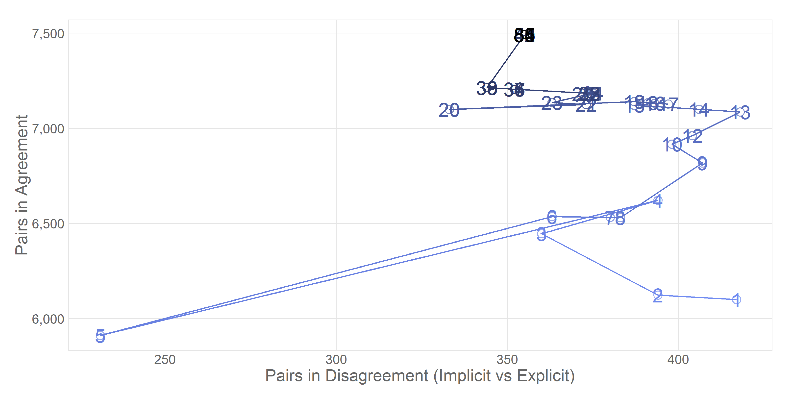
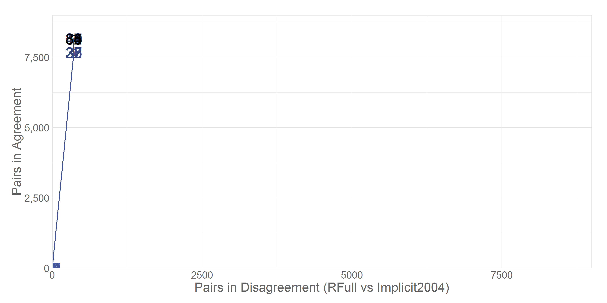

# ROC of Link's Progression

This report describes the amount of agreement between different "Relatedness" variables (eg, `RImplicit`, `RExplicit`) across different algorithm versions.

<!--  Set the working directory to the repository's base directory; this assumes the report is nested inside of two directories.-->


<!-- Set the report-wide options, and point to the external code file. -->


<!-- Load the sources.  Suppress the output when loading sources. --> 

```r
#Load any source files that contain/define functions, but that don't load any other types of variables
#   into memory.  Avoid side effects and don't pollute the global environment.
# source("./SomethingSomething.R")
```

<!-- Load 'sourced' R files.  Suppress the output when loading packages. --> 

```r
library(RODBC, quietly=TRUE)
library(ggplot2, quietly=TRUE)
requireNamespace("colorspace", quietly=TRUE)
requireNamespace("grid", quietly=TRUE)
requireNamespace("gridExtra", quietly=TRUE)
```

<!-- Load any global functions and variables declared in the R file.  Suppress the output. --> 

```r
options(show.signif.stars=F) #Turn off the annotations on p-values

# includedRelationshipPaths <- c(1)
includedRelationshipPaths <- c(2)
columnsToConsider <- c("RImplicit", "RExplicit", "RRoster", "RImplicit2004", "RFull", "Count")

archivePath <- "./MicroscopicViews/CrosstabHistoryArchive.csv"
sql <-
  "SELECT Process.tblRelatedStructure.RelationshipPath, Process.tblRelatedValuesArchive.RImplicit, Process.tblRelatedValuesArchive.RExplicit,
    Process.tblRelatedValuesArchive.RRoster, Process.tblRelatedValuesArchive.AlgorithmVersion,
    COUNT(Process.tblRelatedValuesArchive.ID) AS Count, Process.tblRelatedValuesArchive.RImplicit2004, Process.tblRelatedValuesArchive.RFull
  FROM Process.tblRelatedValuesArchive INNER JOIN
    Process.tblRelatedStructure ON Process.tblRelatedValuesArchive.SubjectTag_S1 = Process.tblRelatedStructure.SubjectTag_S1 AND
    Process.tblRelatedValuesArchive.SubjectTag_S2 = Process.tblRelatedStructure.SubjectTag_S2
  GROUP BY Process.tblRelatedStructure.RelationshipPath, Process.tblRelatedValuesArchive.RImplicit, Process.tblRelatedValuesArchive.RExplicit,
    Process.tblRelatedValuesArchive.RRoster, Process.tblRelatedValuesArchive.AlgorithmVersion, Process.tblRelatedValuesArchive.RImplicit2004,
    Process.tblRelatedValuesArchive.RFull"

reportTheme <- theme_light() +
  theme(axis.ticks.length  = grid::unit(0, "cm")) +
  theme(axis.text          = element_text(colour="gray40")) +
  theme(axis.title         = element_text(colour="gray40")) +
  theme(panel.border       = element_rect(colour="gray90")) +
  theme(panel.grid.major   = element_line(colour="gray90")) +
  theme(legend.position    = "none") 
```

<!-- Declare any global functions specific to a Rmd output.  Suppress the output. --> 

```r
#Put presentation-specific code in here.  It doesn't call a chunk in the codebehind file.
```

<!-- Load the datasets.   -->

```r
dsArchive <- read.csv(archivePath, stringsAsFactors=F) # 'ds' stands for 'datasets'

channel <- RODBC::odbcDriverConnect("driver={SQL Server};Server=Bee\\Bass; Database=NlsLinks; Uid=NlsyReadWrite; Pwd=nophi")
odbcGetInfo(channel)
```

```
             DBMS_Name               DBMS_Ver        Driver_ODBC_Ver       Data_Source_Name            Driver_Name 
"Microsoft SQL Server"           "10.50.2500"                "03.52"                     ""         "SQLSRV32.DLL" 
            Driver_Ver               ODBC_Ver            Server_Name 
          "06.02.9200"           "03.80.0000"            "BEE\\BASS" 
```

```r
dsRaw <- sqlQuery(channel, sql, stringsAsFactors=F)
odbcCloseAll()
```

<!-- Tweak the datasets.   -->

```r
dsArchive$RFull <- NA_real_

dsRaw <- plyr::rbind.fill(dsRaw, dsArchive)
dsClean <- dsRaw[dsRaw$RelationshipPath %in% includedRelationshipPaths, ]

versionNumbers <- sort(unique(dsClean$AlgorithmVersion))
# colorVersion <- sequential_hcl(n=length(versionNumbers), c=c(130,40), l=c(130,30))
colorVersion <- colorspace::sequential_hcl(n=length(versionNumbers), c=c(90,0), l=c(60,0))

dsRocExplicitImplicit <- data.frame(Version=versionNumbers, Good=NA_integer_, Bad=NA_integer_)
dsRocExplicitRoster <- data.frame(Version=versionNumbers, Good=NA_integer_, Bad=NA_integer_)
dsRocImplicitRoster <- data.frame(Version=versionNumbers, Good=NA_integer_, Bad=NA_integer_)
dsRocImplicit2004RFull <- data.frame(Version=versionNumbers, Good=NA_integer_, Bad=NA_integer_)

desiredLabels <- sort(unique(c(69, 74, 82, range(versionNumbers), seq(from=0, to=max(versionNumbers), by=5))))
dsRocExplicitImplicitForLabels <- dsRocExplicitImplicit[dsRocExplicitImplicit$Version %in% desiredLabels, ]
dsRocExplicitImplicitForPoints <- dsRocExplicitImplicit[!(dsRocExplicitImplicit$Version %in% desiredLabels), ]
```


```r
for( versionNumber in versionNumbers ) {
  dsSliceRaw <- dsRaw[dsClean$AlgorithmVersion==versionNumber, columnsToConsider]  
  dsSliceClean <- dsClean[dsClean$AlgorithmVersion==versionNumber, columnsToConsider]  
  
  goodSumExplicitImplicit <- sum(dsSliceClean[dsSliceClean$RImplicit==dsSliceClean$RExplicit, "Count"], na.rm=T)
  badSumExplicitImplicit <- sum(dsSliceClean[abs(dsSliceClean$RImplicit - dsSliceClean$RExplicit) >= .25, "Count"], na.rm=T)
  dsRocExplicitImplicit[dsRocExplicitImplicit$Version==versionNumber, c("Good", "Bad")] <- c(goodSumExplicitImplicit, badSumExplicitImplicit)
  
  goodSumExplicitRoster <- sum(dsSliceClean[dsSliceClean$RRoster==dsSliceClean$RExplicit, "Count"], na.rm=T)
  badSumExplicitRoster <- sum(dsSliceClean[abs(dsSliceClean$RRoster - dsSliceClean$RExplicit) >= .25, "Count"], na.rm=T)
  dsRocExplicitRoster[dsRocExplicitRoster$Version==versionNumber, c("Good", "Bad")] <- c(goodSumExplicitRoster, badSumExplicitRoster)  
  
  goodSumImplicitRoster <- sum(dsSliceClean[dsSliceClean$RRoster==dsSliceClean$RImplicit, "Count"], na.rm=T)
  badSumImplicitRoster <- sum(dsSliceClean[abs(dsSliceClean$RRoster - dsSliceClean$RImplicit) >= .25, "Count"], na.rm=T)
  dsRocImplicitRoster[dsRocImplicitRoster$Version==versionNumber, c("Good", "Bad")] <- c(goodSumImplicitRoster, badSumImplicitRoster)
  
  goodSumImplicit2004RFull <- sum(dsSliceClean[dsSliceClean$RImplicit2004 ==dsSliceClean$RFull, "Count"], na.rm=T)
  badSumImplicit2004RFull <- sum(dsSliceClean[abs(dsSliceClean$RImplicit2004 - dsSliceClean$RFull) >= .25, "Count"], na.rm=T)
  dsRocImplicit2004RFull[dsRocImplicit2004RFull$Version==versionNumber, c("Good", "Bad")] <- c(goodSumImplicit2004RFull, badSumImplicit2004RFull)
}
```


```r
arrowColor <- "gray90"
dsPublish <- dsRocExplicitImplicit[dsRocExplicitImplicit$Version<=40, ]
g1Publish <- ggplot(dsPublish, aes(y=Good, x=Bad, label=Version, color=Version)) + 
  geom_abline(color=arrowColor, linetype="F5") +
  geom_path(size=3, alpha=.15, lineend="round") +
  # geom_point(shape=21, size=3, alpha=.7) +
  # geom_text(data=dsRocExplicitImplicitForLabels) +
  geom_text(alpha=.7) +
  scale_colour_gradientn(colours=colorVersion) +#, color=ColorVersion)
  scale_x_continuous(labels=scales::comma) +
  scale_y_continuous(labels=scales::comma) +
  reportTheme +
  theme(plot.margin = grid::unit(c(0, .2, 0, 0), "lines")) +
  labs(x="Pairs in Disagreement (Implicit vs Explicit)", y="Pairs in Agreement", title=NULL)

x_limit <- c(225, 425)
y_limit <- c(5850, 7550)
xy_max <- 7800

xy_ratio <- (diff(x_limit)/diff(y_limit)) / (xy_max/xy_max)

gridExtra::grid.arrange(
  g1Publish + coord_fixed(xlim=c(0, xy_max), ylim=c(0, xy_max), ratio=1),
  g1Publish + coord_fixed(xlim=x_limit, ylim=y_limit, ratio=xy_ratio) + labs(y=""),
  ncol = 2
)
```

 


```r
g1 <- ggplot(dsRocExplicitImplicit, aes(y=Good, x=Bad, label=Version, color=Version)) +
  geom_path() +
  geom_point(shape=21, size=3, alpha=.7) +
  geom_text() +
  scale_colour_gradientn(colours=colorVersion) +#, color=ColorVersion)
  scale_x_continuous() +#   scale_x_continuous(name="") +
  scale_y_continuous(labels=scales::comma) +
  labs(x="Pairs in Disagreement (Implicit vs Explicit)", y="Pairs in Agreement") +
  reportTheme
# coord_cartesian(xlim=c(0, 8000), ylim=c(0, 8000)) + #coord_equal()
g1
```

 


```r
g1 %+% dsRocExplicitRoster + 
  labs(x="Pairs in Disagreement (Roster vs Explicit)")
```

 


```r
g1 %+% dsRocImplicitRoster + 
  labs(x="Pairs in Disagreement (Roster vs Implicit)")
```

 


```r
g1 %+% dsRocImplicit2004RFull + 
  labs(x="Pairs in Disagreement (RFull vs Implicit2004)") + 
  coord_cartesian(xlim=c(0, 9000), ylim=c(0, 9000))
```

 


# Session Information
For the sake of documentation and reproducibility, the current report was rendered on a system using the following software.


```
Report rendered by Will at 2015-09-26, 18:19 -0500
```

```
R version 3.2.2 Patched (2015-09-18 r69405)
Platform: x86_64-w64-mingw32/x64 (64-bit)
Running under: Windows >= 8 x64 (build 9200)

locale:
[1] LC_COLLATE=English_United States.1252  LC_CTYPE=English_United States.1252    LC_MONETARY=English_United States.1252
[4] LC_NUMERIC=C                           LC_TIME=English_United States.1252    

attached base packages:
[1] stats     graphics  grDevices utils     datasets  methods   base     

other attached packages:
[1] ggplot2_1.0.1 RODBC_1.3-12  knitr_1.11   

loaded via a namespace (and not attached):
 [1] Rcpp_0.12.1      digest_0.6.8     MASS_7.3-44      grid_3.2.2       plyr_1.8.3       gtable_0.1.2    
 [7] formatR_1.2.1    magrittr_1.5     scales_0.3.0     evaluate_0.8     stringi_0.5-5    reshape2_1.4.1  
[13] rmarkdown_0.8    labeling_0.3     proto_0.3-10     tools_3.2.2      stringr_1.0.0    munsell_0.4.2   
[19] yaml_2.1.13      colorspace_1.2-6 htmltools_0.2.6  gridExtra_2.0.0 
```
